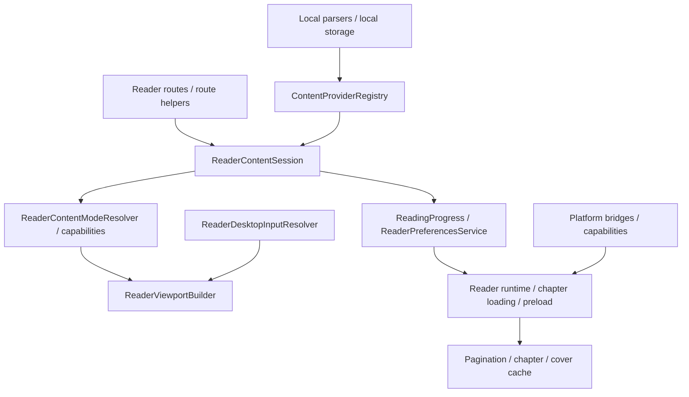

# 里程碑 06：阅读器全平台可用与架构收敛

创建日期：2026-06-05

状态：阶段一已完成；阶段二 / 阶段三已完成 Web JS 构建、桌面输入收口和 macOS 构建基线；阶段四已完成代码级移动端保护回归与 Android / iOS 构建，真机 / 模拟器手工 smoke 待补；阶段五已完成 ReaderRuntime / Platform / Session / Settings / Catalog 的首批表现层收口；阶段六已完成本地阅读全平台策略、parser 输入、编码、PDF / EPUB / Kindle 路线和受管资产边界记录；阶段七 / 阶段八已完成交互自适应策略、可访问性能力矩阵、性能预算、长任务策略和缓存治理验证记录；阶段九已完成阅读器目标单测、本地 parser、presentation smoke、guard 和 Web / macOS / Android / iOS 构建收尾记录。

适用平台：Android、iOS、Web JS、macOS、Windows、Linux。

核心目标：让阅读器从“移动端体验稳定、桌面和 Web 逐步能跑”进入“全平台可用、能力边界清楚、架构可继续维护”的阶段。M6 不替代 M3 在线阅读链、M4 本地内容资源治理、M5 长期门禁，而是在它们之上把阅读器单独收束成可执行专项。

后续执行规则：每次只领取一个最小任务编号，例如 `M6-03-02`。如果执行中发现任务仍然过大，先拆本文档，再改代码。

## 1. 当前实现梳理

### 1.1 路由与入口

| 能力 | 当前落点 | 现状 |
| --- | --- | --- |
| 标准阅读入口 | `lib/features/reader/routes.dart`、`lib/features/reader/presentation/reader_route.dart` | 标准 route 为 `/reader/:bookId/:chapterId`，query 携带 `chapterUrl`、`sourceId`、`detailUrl`、`chapterIndex`、`bookmarkId`、`openRouteKind` 等身份。 |
| 本地旧入口兼容 | `lib/features/reader/routes.dart` | `/local/reader/:bookId/:chapterId` 会重定向到标准 reader route，并补齐 local source/detail/chapter URL。 |
| 详情开始阅读 | `lib/features/book/application/book_detail_read_route_service.dart`、`ReaderEntryRouteResolver` | 通过 route helper 构造阅读入口，避免页面裸拼复杂 route。 |
| 书架继续阅读 | `ReadingProgress`、`ReaderPreferencesService`、书架 route service | 继续阅读依赖持久化进度补齐 route 缺失字段，Web 刷新和桌面重启也依赖这条路径。 |

### 1.2 内容源与内容模式

| 层级 | 当前落点 | 现状 |
| --- | --- | --- |
| 内容源抽象 | `ContentProvider`、`ContentProviderRegistry` | 统一 `loadDetail` 和 `loadChapterContent`，页面不直接区分网络 / 本地解析实现。 |
| 在线内容 | `ServerGatewayContentProvider` | 当前 registry 默认接入服务器网关，支持详情、完整目录和正文加载；可换源，当前不启用章节缓存入口。 |
| 本地内容 | `LocalContentProvider` | 支持本地图书详情、目录和章节正文，能力上禁换源、禁远程章节缓存，支持重建本地索引。 |
| 内容模式 | `ReaderContentModeResolver` | 当前按 `text`、`hybrid`、`comic`、`audio` 四类分发。 |
| Hybrid 子模式 | `ReaderHybridSubMode` | PDF、固定版式 EPUB、绘本 / 杂志、扫描型文档归入固定页 / 图文混合路径。 |

### 1.3 阅读器状态与运行时

| 能力 | 当前落点 | 现状 |
| --- | --- | --- |
| 会话身份 | `ReaderContentSession` | 汇总书籍、章节、内容类型、音频、PDF 源文件、页数、目录和进度等运行态信息。 |
| 进度快照 | `ReadingProgress`、`ReaderPositionSnapshot`、`ReaderLogicalPosition` | 已支持旧比例进度、文本逻辑位置、分页页码、图片 index、hybrid 页码、audio 位置等字段。 |
| 设置持久化 | `ReaderPreferencesService` | 保存字体、排版、背景、翻页、自动阅读、信息栏、阅读进度和目录快照。 |
| 阅读记录 | `ReadingRecordService`、`ReaderReadingRecordCoordinator` | 负责阅读时长、记录 session 和统计链。 |
| 章节加载与预取 | `ReaderContentLoadingController`、`ReaderPreloadController`、`ReaderChapterWindowController` | 已有章节加载、相邻章节窗口、低优先级预取和取消 token 语义。 |
| 分页与缓存 | `ReaderPaginationEngine`、`ReaderPaginationCacheService` | 支持文本分页、持久化分页缓存、内存 LRU 和预计算布局。 |

### 1.4 表现层与输入

| 能力 | 当前落点 | 现状 |
| --- | --- | --- |
| 页面总控 | `ReaderPage` | 仍是主汇总态页面，约 6000 行，直接持有大量控制器、计时器、状态和平台服务。 |
| Shell / Chrome | `ReaderShell`、`ReaderChromeResolver`、`ReaderChromeWidgets` | 已有 shell 和信息栏拆分，顶部 / 底部 overlay 仍主要由 `ReaderPage` part 文件驱动。 |
| 视口分发 | `reader_page_viewport.dart`、`ReaderViewportBuilder` | 按 text scroll、text paged、hybrid paged、comic scroll/paged、audio 分发。 |
| 文本视图 | `ReaderTextScrollView`、`ReaderTextPagedView` | 支持滚动 / 分页、选中文本、注释 / 书签、高亮、图文块渲染。 |
| 图片 / 漫画 | `ReaderMangaView` | 支持连续滚动和分页模式。 |
| PDF | `ReaderPdfView` + `pdfrx` | 本地 PDF 当前在 hybrid 模式中用 `pdfrx` 按文件路径渲染。 |
| 音频 | `ReaderAudioView`、`ReaderAudioController` | 已有基础播放、倍速、章节前后跳转入口，后台 / 定时等仍是后续项。 |
| 桌面输入 | `_handleReaderKeyEvent`、`_handleReaderPointerSignal`、`ReaderDesktopInputResolver` | 支持 Esc、方向键、PageUp/PageDown、Home/End、滚轮翻页；resolver 已有单测，但页面仍有重复逻辑可收口。 |
| 移动端桥 | `ReaderScreenBrightnessBridge`、`ReaderVolumeKeyPageBridge` | 亮度和音量键翻页只在 Android / iOS 原生端启用，Web / Desktop 降级。 |

### 1.5 本地内容与格式

| 格式 | 当前实现 | 当前策略 |
| --- | --- | --- |
| TXT | `TxtLocalBookParser`、`LocalTextEncodingDetector` | 保留定制流式解析，覆盖中文网文章节规则、多编码检测、大文件 offset 和长章节拆分。 |
| EPUB | `EpubLocalBookParser`、`LocalMarkupBookParserSupport` | 保留定制 parser，索引阶段已有 isolate 试点；成熟库先从 metadata / OPF / TOC adapter 试点。 |
| PDF | `PdfLocalBookParser`、`PackagePdfTextExtractor`、`ReaderPdfView` | 文本抽取仍经 `pdf_text_extract` adapter，固定页渲染用 `pdfrx`；后续目标是统一 PDF 路线并退出旧插件。 |
| MOBI / AZW / AZW3 | `KindleLocalBookParser` | 当前标记为实验能力，只承诺无 DRM 基础样例，复杂变体优先清晰失败。 |
| HTML / Markdown | `HtmlLocalBookParser`、`MarkdownLocalBookParser` | 作为本地内容附属格式，复用 markup 支撑和 `ReaderDocument`。 |

## 2. 当前全平台结论

| 平台 | 当前结论 | M6 重点 |
| --- | --- | --- |
| Android | 移动端稳定基线，阅读器手势、亮度、音量键、Safe Area、系统返回必须保护。 | 任何共享层改动都要补移动端阅读回归。 |
| iOS | 移动端稳定基线，需额外关注 iOS 模拟器电量读取、Safe Area、返回手势和 Files 沙盒。 | 亮度 / 音量键桥、PDF、本地导入要真机或模拟器 smoke。 |
| Web JS | `flutter build web --no-pub` 已于 2026-06-05 通过；WASM dry-run 提醒 `sqlite3/ffi` 不兼容，WASM 仍为独立专项。 | 在线阅读先做到刷新恢复、键盘 / 滚轮、能力降级；本地文件路径不能假装可用。 |
| macOS | `flutter build macos --debug --no-pub` 已于 2026-06-05 通过，属于桌面优先适配目标。 | 窗口、键盘、鼠标、PDF 文件路径、目录 / 设置弹层要真实 smoke。 |
| Windows | 需要 Windows 机器或 CI 补验，不能用 macOS 结果替代。 | 重点是构建、文件路径、字体渲染、滚轮、PDF、本地导入和性能基线。 |
| Linux | 需要 Linux 机器或 CI 补验，不能用 macOS / Windows 结果替代。 | 重点是发行版依赖、文件选择器、字体渲染、窗口和 PDF / 本地导入。 |

## 3. 主要风险与优化方向

| 优先级 | 风险 | 影响 | 默认方向 |
| --- | --- | --- | --- |
| P0 | 阅读器入口、进度恢复或 route 身份丢失 | Web 刷新、桌面重启、书架继续阅读会错位。 | 所有入口继续使用 route helper，进度 fallback 保持兼容并补测试。 |
| P0 | 本地用户资产 / 阅读进度被缓存治理误删 | 影响用户书籍、字体、背景、进度和书签。 | 继续走 `ManagedAssetStore`、本地图书受管目录和 cache governance 边界。 |
| P0 | Web / Desktop 引入 native-only import 或文件路径假设 | Web JS 编译或运行失败。 | 原生能力通过 capability、adapter、conditional import 或明确禁用态。 |
| P1 | `ReaderPage` 和设置 / 目录 sheet 过大 | 后续改动容易互相踩踏，移动端和桌面路径难隔离。 | 等价拆 facade、controller、presenter、platform adapter 和 desktop shell，不一次性重写。 |
| P1 | PDF 路线多库并存 | 依赖维护、SPM、平台支持和文本抽取职责不清。 | 以 `pdfrx` / PDFium 能力为主线做 adapter spike，保留旧 adapter 直到替换可证明。 |
| P1 | 本地解析仍以 `dart:io` 和原生路径为核心 | Web 本地阅读无法直接复用。 | Web 先禁用 native local reading，再做上传 bytes / IndexedDB 独立策略。 |
| P2 | 桌面输入逻辑散在页面方法里 | 快捷键、滚轮、focus 行为难测。 | 将页面实现收口到 `ReaderDesktopInputResolver` 或等价 controller。 |
| P2 | 设置弹层移动端 / 桌面端形态混杂 | 宽屏体验和触控体验容易互相影响。 | 保留移动端 bottom sheet，桌面改为 dialog / side panel / popover 形态。 |
| P2 | AudioReader 能力仍偏基础 | 听书全平台体验不完整。 | 后置为 M6 中后段，先保证基础播放、进度、章节跳转和降级。 |

## 4. M6-01 阅读器全平台基线盘点

- [x] M6-01-01 复核阅读器入口清单：详情开始阅读、目录章节、书架继续阅读、阅读记录、书签、本地旧路由、Web 直接 URL。
- [x] M6-01-02 输出阅读器代码结构图：route、content provider、session、progress、viewport、platform bridge、local parser、cache。
- [x] M6-01-03 输出六平台能力矩阵：在线阅读、本地阅读、PDF、音频、亮度、音量键、键盘、滚轮、文件导入、缓存和诊断。
- [x] M6-01-04 建立阅读器 smoke 模板，覆盖打开、加载、翻页 / 滚动、目录、设置、进度保存、返回、失败重试。
- [x] M6-01-05 记录当前 Web JS 构建结果和 Web WASM dry-run 风险，不把 WASM 纳入 M6 默认交付。
- [x] M6-01-06 确认 M3-04 在线阅读链、M4 本地内容治理、M5 guard 中与阅读器重叠的任务编号，避免重复领取。

## 5. M6-02 Web JS 在线阅读可用

- [ ] M6-02-01 检查 `/reader/:bookId/:chapterId` 在 Web 刷新、新标签打开、浏览器后退 / 前进后的恢复路径。
- [ ] M6-02-02 检查在线章节加载、正文为空、网络失败、源不可用、换源失败在 Web 的可理解错误态。
- [x] M6-02-03 收口 Web 键盘和滚轮阅读：方向键、PageUp/PageDown、Space、Home/End、Esc 和滚轮节流都要有目标测试。
- [ ] M6-02-04 明确 Web 不支持的移动端能力：亮度、音量键、native 文件路径、本地受管文件目录，入口必须禁用、隐藏或显示降级说明。
- [ ] M6-02-05 检查 Web 文本选择、复制、注释 / 书签工具栏和 overlay 层级，不得被浏览器选择行为或滚轮抢焦点破坏。
- [ ] M6-02-06 补 Web 阅读器 widget smoke 或 browser smoke，至少覆盖 390、840、1280 宽度。
- [x] M6-02-07 将 `flutter build web --no-pub` 纳入 M6 任务收尾记录；如失败，记录具体 import / 插件 / 路由阻塞。

## 6. M6-03 Desktop 阅读器可用

- [ ] M6-03-01 检查 macOS 从详情、书架、阅读记录、书签进入 reader 的打开和返回路径。
- [ ] M6-03-02 检查 Windows 从详情、书架、阅读记录、书签进入 reader 的打开和返回路径，不能用 macOS 结果替代。
- [ ] M6-03-03 检查 Linux 从详情、书架、阅读记录、书签进入 reader 的打开和返回路径，不能用 macOS / Windows 结果替代。
- [x] M6-03-04 将桌面键盘 / 滚轮动作从页面散点收口到 resolver / controller，并补单测。
- [ ] M6-03-05 检查桌面窗口缩放、最小窗口、可读最大宽度、左右留白、信息栏、目录和设置弹层不溢出。
- [x] M6-03-06 为桌面设置面板定义 dialog / side panel / popover 策略，不反向改移动端 bottom sheet 体验。
- [ ] M6-03-07 检查桌面 PDF 阅读：文件存在、页码恢复、窗口缩放、滚轮、缩放、失败态和进度保存。
- [x] M6-03-08 输出 macOS、Windows、Linux 三端独立验收记录，未验证平台写清机器和阻塞原因。

## 7. M6-04 Android / iOS 移动端保护回归

- [ ] M6-04-01 检查移动端从详情开始阅读、目录进章节、书架继续阅读、书签跳转的旧体验不回退。
- [ ] M6-04-02 检查触控翻页、滑动、点击分区、长按选择、系统返回、沉浸式和 Safe Area。
- [ ] M6-04-03 检查阅读设置、目录、换源、章节缓存、自动阅读、书签 / 注释弹层仍按移动端交互展示。
- [ ] M6-04-04 检查亮度桥和音量键翻页：只在 Android / iOS 原生端启用，弹层 / 选中 / 加载态不拦截。
- [ ] M6-04-05 检查移动端本地 TXT / EPUB / PDF / MOBI 打开、失败提示和重建索引路径。
- [x] M6-04-06 运行 Android / iOS 构建或记录真实阻塞；涉及原生桥、Info.plist、AndroidManifest 时必须补真机 / 模拟器 smoke。

## 8. M6-05 阅读器表现层架构收敛

- [x] M6-05-01 拆出 `ReaderRuntimeFacade` 或等价 controller，先承接章节加载、进度保存、预取、阅读记录和错误态，不改变 UI。
- [x] M6-05-02 将 `ReaderPage` 中的桌面输入、移动端桥接、系统 UI、亮度、电量读取收口到 platform facade / capability。
- [x] M6-05-03 将 `ReaderPage` 中的 content session 构造、mode/capability 解析、viewport state 解析迁到 application 层可测试服务。
- [x] M6-05-04 拆分 `reader_page_settings_sheet.dart`：按界面、阅读、自动阅读、信息栏、字体 / 背景、实验能力分 section presenter。
- [x] M6-05-05 拆分 `reader_catalog_sheet.dart`：目录数据、搜索、跳转、桌面 / 移动展示策略分离。
- [x] M6-05-06 审计 `ReaderPage` 体量，目标从 6000 行警戒降到可维护区间；每次拆分必须等价迁移并补测试。
- [x] M6-05-07 为新增 public class、provider、facade、adapter、storage key 和复杂进度逻辑补中文维护注释。

## 9. M6-06 本地阅读全平台策略

- [x] M6-06-01 明确 Web 本地阅读首版策略：禁用 native local reading，或以浏览器上传 bytes + 可重建缓存作为独立入口。
- [x] M6-06-02 让本地 parser 输入统一走 `LocalBookParserInputAware` 或等价 adapter，避免 native path 和 Web bytes 分叉扩散到 parser 外。
- [x] M6-06-03 复查 TXT 编码检测：storage、preview、parser 继续共用 `LocalTextEncodingDetector`，移动端插件失败要有 fallback。
- [x] M6-06-04 继续 EPUB 成熟库 adapter spike：先替 metadata / OPF / TOC 层，保留 `ReaderDocument` 和 inline image 输出。
- [x] M6-06-05 做 PDF 路线统一：明确 `pdfrx`、PDFium、`pdf_text_extract` 的职责、平台支持和退出条件。
- [x] M6-06-06 将 MOBI / AZW / AZW3 保持实验能力，补 DRM、编码、图片资源、超大文件和失败样例验收。
- [x] M6-06-07 检查本地图书、字体、背景、封面和 PDF 源文件都在受管目录，不被 cache/tmp 清理误删。
- [x] M6-06-08 为 Android、iOS、macOS、Windows、Linux 本地导入分别记录文件选择器、沙盒、路径和重建索引结果。

## 10. M6-07 阅读交互、可访问性与自适应

- [x] M6-07-01 建立阅读器宽度检查：390、600、840、1280、1600 视口下正文、overlay、目录、设置和错误态不重叠。
- [x] M6-07-02 检查字体缩放：阅读正文使用 reader 设置，chrome / sheet 使用界面文字缩放上限，不出现按钮文字溢出。
- [x] M6-07-03 检查 focus ring、Tab 顺序、Esc 关闭、Enter 激活、滚轮行为和 hover 状态。
- [x] M6-07-04 检查文本选择、书签 / 注释工具栏、图片预览、PDF 缩放手势在移动端和桌面端的差异。
- [x] M6-07-05 检查自动阅读在文本分页、文本滚动、低电量、后台、overlay、章节边界的状态机。
- [x] M6-07-06 检查阅读背景、主题、亮度遮罩、深色模式和高对比文本颜色，不让装饰图影响可读性。

## 11. M6-08 性能、长任务与缓存

- [x] M6-08-01 建立阅读器启动到首屏可见、首章加载、第一次翻页、章节切换、目录打开、设置打开的性能基线。
- [x] M6-08-02 检查文本分页、图文分页、PDF 打开、大图解码、EPUB 解包、TXT 大文件切章的主 isolate 占用。
- [x] M6-08-03 继续使用 `ReaderResourceBudgetResolver` 控制低端设备、低电量、图片解码和预取预算。
- [x] M6-08-04 确认分页缓存、章节缓存、封面缓存和本地 parser 临时文件进入统一 cache governance，不碰用户资产。
- [x] M6-08-05 为 Web JS 记录内存和大章节行为，避免大文本 / 大图在浏览器中一次性撑爆。
- [x] M6-08-06 输出 Android、iOS、Web JS、macOS、Windows、Linux 的性能基线或未验证原因。

## 12. M6-09 测试、构建与 guard

- [x] M6-09-01 运行阅读器目标单测：route、content mode、mode capabilities、session、progress、pagination、auto read、desktop input。
- [x] M6-09-02 运行本地 parser 目标单测：TXT、encoding、EPUB、PDF、MOBI、local chapter content、local index。
- [x] M6-09-03 运行 presentation widget / smoke：viewport builder、paged controller、runtime controller、chrome、settings presenter、annotation。
- [x] M6-09-04 运行 `flutter analyze`、route guard、architecture guard、storage guard、dependency override guard。
- [x] M6-09-05 运行 `flutter build web --no-pub`，记录 Web JS 与 Web WASM dry-run 结果。
- [x] M6-09-06 运行 macOS / Windows / Linux 至少一个桌面构建时，按项目规则同步记录 Android / iOS 构建或真实阻塞。
- [x] M6-09-07 为高确定性问题评估新增 guard：presentation 直接文件系统访问、ReaderPage 裸平台判断、复杂 reader route 裸字符串。

## 13. M6-10 验收与接力

- [ ] M6-10-01 输出阅读器六平台验收记录：每个平台必须写已验证、代码级不回退、未验证原因或发布前补验要求。
- [ ] M6-10-02 输出能力降级清单：Web、本地阅读、PDF、亮度、音量键、文件导入、诊断、音频。
- [ ] M6-10-03 更新 README、AI 执行序列、reader developer notes 和相关 regression checklist。
- [ ] M6-10-04 将暂不替换或暂不支持项登记到长期看板，包含影响平台、推荐方向、验证入口和退出条件。
- [ ] M6-10-05 明确下一轮最小任务编号，不能只写“继续优化阅读器”。

## 14. M6 收尾矩阵

每个 M6 任务完成时必须记录：

| 项目 | 必填结论 |
| --- | --- |
| 业务链 | 在线阅读、本地阅读、PDF、音频、设置、目录、进度、缓存、书架继续阅读中哪些被影响。 |
| 修改范围 | route、provider、service、facade、presentation、parser、storage、platform bridge、capability、theme 是否修改。 |
| Android | 已验证 / 代码级不回退 / 未验证原因 / 发布前补验要求。 |
| iOS | 已验证 / 代码级不回退 / 未验证原因 / 发布前补验要求。 |
| Web JS | 构建、刷新恢复、键盘 / 滚轮、路由、浏览器存储、不支持能力降级。 |
| macOS | 构建、启动、窗口、键鼠、PDF、本地文件、外部打开、凭证能力。 |
| Windows | 独立构建或 CI / 手动补验，不能用 macOS 结果替代。 |
| Linux | 独立构建或 CI / 手动补验，不能用 macOS / Windows 结果替代。 |
| 测试与构建 | 实际执行命令、通过 / 失败、未运行原因和后续补验方式。 |
| 注释与文档 | 新增复杂代码是否补中文维护注释，相关 docs / checklist 是否同步。 |

## 15. M6 阶段一到三执行记录（2026-06-05）

### 15.1 M6-01 阅读器全平台基线盘点

#### 入口清单

| 入口 | 当前落点 | 阶段一结论 |
| --- | --- | --- |
| 详情开始阅读 | `BookDetailReadRouteService`、`ReaderEntryRouteResolver` | 继续使用 route helper 生成 `/reader/:bookId/:chapterId`，不允许页面裸拼复杂 reader route。 |
| 目录章节阅读 | `ReaderRouteData`、`ReaderContentSession` | route query 承载 `chapterUrl`、`sourceId`、`detailUrl`、`chapterIndex` 等身份，缺失时进入可解释失败 / fallback。 |
| 书架继续阅读 | `BookshelfReaderOpenService`、`ReaderPreferencesService` | 依赖持久化 `ReadingProgress` 补齐章节身份；本次未修改书架进入链路。 |
| 阅读记录进入 | 阅读记录 route / reader route helper | 仍归入标准 reader route，后续 smoke 要验证返回栈和进度恢复。 |
| 书签跳转 | `bookmarkId` query、reader 进度恢复 | 作为标准 reader query 的附加语义，不单独开新入口。 |
| 本地旧路由 | `/local/reader/:bookId/:chapterId` redirect | 保持重定向到标准 reader route，并补 local source/detail/chapter URL。 |
| Web 直接 URL | `/reader/:bookId/:chapterId` | 构建通过；刷新、新标签、后退 / 前进仍需 M6-02-01 browser smoke。 |

#### 代码结构图

#### 六平台能力矩阵

| 平台 | 在线阅读 | 本地阅读 | PDF | 音频 | 亮度 / 音量键 | 键盘 / 滚轮 | 文件导入 / 缓存 / 诊断 | 阶段一结论 |
| --- | --- | --- | --- | --- | --- | --- | --- | --- |
| Android | 需保护移动端触控、沉浸式、系统返回和进度恢复。 | Native 文件路径和受管目录可用，后续补真实导入 smoke。 | `pdfrx` 渲染 + 移动端文本抽取链路需继续验。 | 基础播放链路存在，后台 / 定时后置。 | 亮度、音量键桥只在移动端启用。 | 外接键盘非首要，滚轮不替代触控基线。 | 缓存 guard 通过；诊断跟随 M4 / M5。 | 本次 `flutter build apk --debug --no-pub` 通过。 |
| iOS | 需保护 Safe Area、返回手势和进度恢复。 | Files 沙盒 / 导入需真机或模拟器 smoke。 | PDF 构建通过，真实打开仍需 smoke。 | 基础播放链路存在，后台能力后置。 | 亮度、音量键桥按 iOS 能力降级。 | 外接键盘后续可补。 | 缓存 guard 通过；诊断跟随 M4 / M5。 | 本次 `flutter build ios --no-codesign --no-pub` 通过。 |
| Web JS | 在线阅读为 M6-02 首要目标。 | Native 本地路径不可用，Web 上传 bytes / IndexedDB 属独立策略。 | `pdfrx` Web 资源可参与构建，真实 PDF Web smoke 待补。 | 浏览器播放策略需单独验。 | 不支持 native 亮度 / 音量键。 | 已收口键盘 / 滚轮 resolver 并补测试。 | `flutter build web --no-pub` 通过；WASM 因 FFI 另列专项。 | 代码级和构建级通过，browser smoke 待补。 |
| macOS | 在线 reader 构建基线通过。 | 本地路径可用，需真实文件选择和重启恢复 smoke。 | 需要验证文件存在、页码恢复、缩放和失败态。 | 基础播放需桌面音频 smoke。 | native 亮度 / 音量键桥不启用。 | 已收口键盘 / 滚轮 resolver 并补测试。 | macOS debug 构建通过；窗口 / 文件 / PDF smoke 待补。 | 本次 `flutter build macos --debug --no-pub` 通过。 |
| Windows | 不可用 macOS 结果替代。 | 需 Windows 机器或 CI 验证路径、字体、文件选择和 PDF。 | 需独立验。 | 需独立验。 | 不启用移动端桥。 | resolver 代码级覆盖，运行时焦点需验。 | 需要 Windows CI / 目标机。 | 当前会话无 Windows 目标环境，登记待补。 |
| Linux | 不可用 macOS / Windows 结果替代。 | 需 Linux 机器或 CI 验证发行版依赖、文件选择和字体。 | 需独立验。 | 需独立验。 | 不启用移动端桥。 | resolver 代码级覆盖，运行时焦点需验。 | 需要 Linux CI / 目标机。 | 当前会话无 Linux 目标环境，登记待补。 |

#### 阅读器 smoke 模板

| 步骤 | 必验动作 | 通过标准 |
| --- | --- | --- |
| 打开 | 从详情、目录、书架、阅读记录、书签或直接 URL 进入 reader。 | route 身份完整，不能白屏；缺字段时有 fallback 或错误态。 |
| 加载 | 正常章节、空正文、网络失败、源不可用、本地文件缺失。 | 正常内容可见；失败可理解且可重试 / 返回。 |
| 翻页 / 滚动 | 移动端触控、Web / Desktop 键盘、滚轮、分页和滚动模式。 | 无误触发，自动阅读和 overlay 状态不互相打架。 |
| 目录 | 打开目录、搜索目录、跳章节、返回正文。 | 当前章节高亮和进度恢复正确。 |
| 设置 | 打开阅读设置、调整字体 / 背景 / 翻页 / 信息栏。 | 移动端 bottom sheet 和桌面弹层策略不互相破坏。 |
| 进度保存 | 阅读几页后返回，再从书架 / 详情 / 直接 URL 进入。 | 恢复到合理章节和位置，旧进度字段兼容。 |
| 返回 | App 返回键、浏览器后退、桌面 Esc / 系统返回习惯。 | 返回合理入口；直接 URL 没历史时不白屏。 |
| 失败重试 | 网络失败、本地文件丢失、PDF 打开失败。 | 错误文案明确，重试 / 回退路径可用。 |

### 15.2 M6-02 Web JS 在线阅读执行结论

- 已完成 `M6-02-03`：`ReaderDesktopInputResolver` 统一解析 Web / Desktop 键盘和滚轮动作，页面层只执行语义动作；新增中文维护注释说明 Web / Desktop 输入决策必须集中，避免后续快捷键和自动阅读分叉。
- 已完成 `M6-02-07`：`flutter build web --no-pub` 通过，产物为 `build/web`。
- Web WASM dry-run 仍提示 `sqlite3` / `ffi` 包含 `dart:ffi`，这是 WebAssembly 独立专项，不纳入 M6 默认交付。
- 未完成项：`M6-02-01` 刷新 / 新标签 / 后退前进 browser smoke，`M6-02-02` Web 错误态手测，`M6-02-04` Web 不支持能力入口禁用核查，`M6-02-05` 文本选择 / 注释工具栏层级核查，`M6-02-06` 390 / 840 / 1280 browser smoke。

### 15.3 M6-03 Desktop 阅读器执行结论

- 已完成 `M6-03-04`：桌面键盘 / 滚轮动作从 `ReaderPage` 页面散点收口到 `ReaderDesktopInputResolver`，并补目标单测。
- 已完成 `M6-03-08` 的记录输出：macOS debug 构建通过；Windows / Linux 当前会话没有目标机器或 CI，不能用 macOS 结果替代，需后续在目标平台独立补验。
- 2026-06-07 追加完成 `M6-03-06`：新增 `ReaderPanelLayoutSpec` / `ReaderPanelRole`，统一阅读器桌面目录、设置和二级操作的 UI/UX 形态。移动端继续走 bottom sheet，桌面目录和设置走右侧 side panel，二级操作保留 dialog 策略；`reader_catalog_sheet.dart` 和 `reader_page_settings_panel.dart` 改为消费同一策略，不再各自散落宽度和对齐判断。
- 2026-06-07 追加明确桌面 overlay 口径：小说正文不铺满文字列，继续居中并限制文本最大宽度；桌面点击正文中心后，目录、自动阅读、夜间和界面设置动作进入顶部工具条，底部只保留居中的轻量进度控制。移动端仍保留底部大按钮栏，不改触控路径。
- macOS 本次只完成构建基线，不等价于 `M6-03-01` 的详情 / 书架 / 阅读记录 / 书签真实打开路径 smoke。
- 未完成项：`M6-03-01` 到 `M6-03-03` 真实桌面入口 smoke，`M6-03-05` 真实窗口拖拽、信息栏、目录和设置弹层溢出核查，`M6-03-07` 桌面 PDF 阅读 smoke。

### 15.4 M3 / M4 / M5 重叠边界

| 来源任务 | 与 M6 的重叠 | 本轮处理 |
| --- | --- | --- |
| M3-04 在线阅读链 | route、progress、session、Web 刷新、Desktop 键鼠、六平台阅读验收。 | M6 只推进 reader 专项的输入收口和构建记录；M3-04 手工验收项仍保留，不重复勾。 |
| M4 本地内容治理 | TXT / EPUB / PDF / MOBI、本地文件、用户资产、缓存边界、长任务。 | M6 阶段一只盘点能力边界；Web 本地阅读和 PDF 路线统一继续归 M6-06 / M4 后续。 |
| M5 guard / CI / 依赖健康 | route guard、storage guard、dependency override、architecture guard、Web / Desktop build。 | 本轮补跑相关 guard；新增 `screen_retriever_macos` override 治理登记，让 dependency override guard 回绿。 |

### 15.5 验证记录

| 命令 / 检查 | 结果 |
| --- | --- |
| `dart format lib/features/reader/application/reader_desktop_input_resolver.dart lib/features/reader/presentation/reader_page.dart lib/features/reader/presentation/reader_page_shell.dart test/features/reader/application/reader_desktop_input_resolver_test.dart` | 通过。 |
| `dart format lib/features/reader/presentation/reader_layout_context.dart lib/features/reader/presentation/reader_page_settings_panel.dart lib/features/reader/presentation/reader_catalog_sheet.dart test/features/reader/presentation/reader_layout_context_test.dart` | 通过。 |
| `dart analyze lib/features/reader/presentation/reader_layout_context.dart lib/features/reader/presentation/reader_page_settings_panel.dart lib/features/reader/presentation/reader_catalog_sheet.dart test/features/reader/presentation/reader_layout_context_test.dart` | 通过，No issues found。 |
| `flutter test test/features/reader/presentation/reader_layout_context_test.dart` | 通过，5 tests passed；覆盖 390 / 600 / 840 / 1280 / 1600 宽度下移动 bottom sheet、桌面 side panel、二级 dialog 和正文最大宽度策略。 |
| `dart analyze lib/features/reader/presentation/reader_page.dart lib/features/reader/presentation/reader_layout_context.dart test/features/reader/presentation/reader_layout_context_test.dart` | 通过，No issues found；覆盖桌面 overlay 动作从底部栏迁移到顶部工具条的代码路径。 |
| `flutter test test/features/reader/presentation/reader_layout_context_test.dart test/features/reader/presentation/reader_chrome_widgets_test.dart test/features/reader/presentation/reader_settings_presenter_test.dart test/features/reader/presentation/reader_viewport_builder_test.dart` | 通过，15 tests passed；覆盖阅读器 layout、chrome、settings presenter 和 viewport 状态。 |
| `flutter build macos --debug --no-pub` | 2026-06-07 本轮通过，生成 `build/macos/Build/Products/Debug/shuxiang_reading_next.app`；仍有 `UniversalDetector2` deployment target 和 duplicate library warning。 |
| `flutter build ios --no-codesign --no-pub` | 2026-06-07 本轮通过，生成 `build/ios/iphoneos/Runner.app`；仍提示 no-codesign 和 UIScene lifecycle。 |
| `flutter build apk --debug --no-pub` | 2026-06-07 本轮未通过：Gradle 下载 `androidx.test:runner:1.2+` 的 Maven metadata 时多次出现 TLS handshake 失败，属于网络 / 依赖解析阻塞；本轮 Dart analyzer 和目标测试已通过，发布前需在网络恢复后重跑 Android 构建。 |
| `flutter analyze` | 通过，No issues found。 |
| `flutter test test/features/reader/application/reader_desktop_input_resolver_test.dart test/features/reader/presentation/reader_route_test.dart test/features/reader/application/reader_entry_route_resolver_test.dart test/features/reader/application/online_reading_chain_smoke_test.dart test/features/reader/presentation/reader_viewport_builder_test.dart test/features/reader/presentation/reader_chrome_widgets_test.dart test/features/reader/presentation/reader_layout_context_test.dart test/features/reader/application/reader_content_mode_resolver_test.dart test/features/reader/application/reader_mode_capabilities_test.dart test/features/reader/application/reader_session_state_resolver_test.dart test/features/book/application/book_detail_read_route_service_test.dart` | 通过，38 tests passed。 |
| `flutter build web --no-pub` | 通过，`build/web` 已生成；WASM dry-run 提示 `sqlite3` / `ffi` 的 `dart:ffi` 不兼容。 |
| `flutter build macos --debug --no-pub` | 通过，生成 `build/macos/Build/Products/Debug/shuxiang_reading_next.app`；仍有 `UniversalDetector2` macOS deployment target warning。 |
| `flutter build apk --debug --no-pub` | 通过，生成 `build/app/outputs/flutter-apk/app-debug.apk`；Flutter 提醒项目和若干插件后续需迁移 Built-in Kotlin。 |
| `flutter build ios --no-codesign --no-pub` | 通过，生成 `build/ios/iphoneos/Runner.app`；有 no-codesign 和 UIScene lifecycle 迁移提醒。 |
| `dart tool/check_route_inventory.dart` | 通过，所有 route path 已登记。 |
| `dart tool/check_route_string_guard.dart` | 通过，未发现裸写复杂 reader / book detail route 字符串。 |
| `dart tool/check_storage_governance_guard.dart` | 通过，未发现新增 storage governance violations。 |
| `dart tool/check_storage_baseline_governance.dart` | 通过，storage baseline 已登记。 |
| `dart tool/check_dependency_override_governance.dart` | 通过；本轮同步登记 `screen_retriever_macos` override。 |
| `dart tool/check_architecture_guardrails.dart` | 未通过：`bookshelf_page.dart` 6850 行、`reader_page.dart` 6024 行超过 presentation hard limit；`advanced_theme_service.dart` 是已登记 split debt，`epub_local_book_parser.dart` 达 warning threshold。归入 M6-05 / 书架后续拆分债务。 |

补充记录：曾尝试把 `test/features/bookshelf/application/bookshelf_reader_open_service_test.dart` 一并纳入阅读器回归，`uses toc snapshot before remote fallback when no progress exists` 出现疑似 `SharedPreferences` / `ReaderPreferencesService` 隔离泄漏，当前不作为 M6-02 / M6-03 阻断；后续如继续书架继续阅读链，应单独领取书架测试隔离任务。

构建前置修复：macOS 构建首次被 `lib/app/shell_scaffold.dart` 里桌面账号菜单改动残留的重复闭合括号阻断；本轮只删除孤立重复括号，让 `flutter analyze` 和 macOS 构建恢复通过，未改变账号菜单业务语义。

## 16. M6 阶段四到五执行记录（2026-06-05）

### 16.1 M6-04 Android / iOS 移动端保护回归

本轮完成代码级移动端保护回归和构建基线，不等价于 Android / iOS 真机完整手工 smoke。当前 `flutter devices` 可见 iOS 模拟器、macOS 和 Chrome；Android AVD 存在但本轮未启动做交互 smoke，无线 iPhone 提示未连接 / Developer Mode 不可用。

| 任务 | 本轮结论 | 后续补验 |
| --- | --- | --- |
| M6-04-01 移动端阅读入口 | 详情开始阅读、reader route、entry resolver、书签 / 本地 fallback 的目标测试通过。书架继续阅读测试此前存在隔离泄漏，未作为本轮通过依据。 | Android / iOS 手工从详情、目录、书架、阅读记录和书签进入 reader。 |
| M6-04-02 触控 / 系统返回 / Safe Area | `ReaderShell` 仍保留 `GestureDetector` 触控入口，`ReaderPage` 仍用 `PopScope` 处理无历史返回到 `/bookshelf`，chrome slot 仍走 `SafeArea`。目标测试覆盖 layout context、paged viewport、runtime controller 和生命周期 delegate。 | 真机或模拟器验证触控翻页、滑动、长按选择、系统返回、沉浸式和安全区。 |
| M6-04-03 设置 / 目录 / 自动阅读 / 注释弹层 | 移动端 action surface 仍默认 `mobileSheet`，桌面 side panel 不反向替换移动端 bottom sheet。目标测试覆盖 settings presenter、navigation presenter、annotation interaction、auto read coordinator。 | 手工验证移动端目录、设置、换源、章节缓存、自动阅读和注释 / 书签弹层。 |
| M6-04-04 亮度桥 / 音量键翻页 | `ReaderPageLifecycle` 仍在进入、暂停、恢复、释放时同步亮度和音量键拦截；`ReaderVolumeKeyPageBridge` 只在平台支持时监听。目标测试覆盖 runtime wake policy 的 overlay、低电量和隐藏态暂停。 | Android / iOS 真机验证亮度、音量键翻页、弹层 / 选中 / 加载态不拦截。 |
| M6-04-05 本地 TXT / EPUB / PDF / MOBI | 本地 entry guard、storage、index、chapter content、TXT、encoding、EPUB、PDF、Kindle parser 和本地图书导入反馈 smoke 均通过。 | Android / iOS 用真实文件验证导入、打开、失败提示和重建索引。 |
| M6-04-06 Android / iOS 构建 | `flutter build apk --debug --no-pub` 与 `flutter build ios --no-codesign --no-pub` 均通过。 | 发布前补真机 / 模拟器 smoke；Android 仍需跟进 Built-in Kotlin 插件迁移提醒，iOS 仍需跟进 UIScene lifecycle 提醒。 |

### 16.2 M6-05 阅读器表现层架构收敛

- 本轮完成 `M6-05-06` 的首批体量审计和等价拆分：新增 `lib/features/reader/presentation/reader_page_widget.dart`，只承载 `ReaderPage` route 参数和 `createState`；`reader_page.dart` 从 6024 行降到 5993 行，退出 architecture guard 的 hard violation，变为 large-file warning。
- 本轮完成 `M6-05-07` 的注释要求：`ReaderPage` 入口 widget、`ReaderDesktopInputAction`、`ReaderDesktopInputResolver` 均补中文维护注释，说明边界和后续拆分风险。
- 2026-06-06 追加完成 `M6-05-01` 的首批 `ReaderRuntimeFacade` 切片：新增 `lib/features/reader/application/reader_runtime_facade.dart`，先承接进度保存防抖、阅读记录 session 启停 / 同步 / 自动提交间隔这些纯业务决策；页面仍持有 timer、滚动控制器和 UI 状态，不改变触控、键鼠、章节加载或预取行为。
- 2026-06-06 追加完成 `M6-05-02` 到 `M6-05-05` 的首批可测试收口：`ReaderPlatformFacade` 承接音量键拦截、系统 UI、亮度和电量轮询决策；`ReaderSessionPresentationFacade` 承接 content session、mode capability 和 viewport state 解析入口；`ReaderSettingsPresenter` 承接设置 section 标题 / 计划；`ReaderCatalogSearchPresenter` 承接目录搜索结果分组和倒序展示。设置和目录 UI 文件仍然较大，后续继续按 section widget / panel 细拆，不能一次性重写。

### 16.3 验证记录

| 命令 / 检查 | 结果 |
| --- | --- |
| `flutter test test/features/reader/presentation/reader_layout_context_test.dart test/features/reader/presentation/reader_page_lifecycle_delegate_test.dart test/features/reader/presentation/reader_runtime_controller_test.dart test/features/reader/presentation/reader_paged_viewport_controller_test.dart test/features/reader/presentation/reader_paged_viewport_support_test.dart test/features/reader/presentation/reader_annotation_interaction_test.dart test/features/reader/presentation/reader_settings_presenter_test.dart test/features/reader/presentation/reader_navigation_presenter_test.dart test/features/reader/presentation/reader_viewport_builder_test.dart test/features/reader/presentation/reader_route_test.dart test/features/reader/application/reader_runtime_wake_policy_test.dart test/features/reader/application/reader_auto_read_coordinator_test.dart test/features/reader/application/reader_chapter_navigation_test.dart test/features/reader/application/reader_entry_route_resolver_test.dart test/features/book/application/book_detail_read_route_service_test.dart` | 通过，69 tests passed。 |
| `flutter test --concurrency=1 --timeout=3x test/features/reader/application/local/local_reader_entry_guard_service_test.dart test/features/reader/application/local/local_book_storage_service_test.dart test/features/reader/application/local/local_book_index_service_test.dart test/features/reader/application/local/local_chapter_content_service_test.dart test/features/reader/application/local/txt_local_book_parser_test.dart test/features/reader/application/local/local_text_encoding_detector_test.dart test/features/reader/application/local/epub_local_book_parser_test.dart test/features/reader/application/local/pdf_local_book_parser_test.dart test/features/reader/application/local/kindle_local_book_parser_test.dart test/features/bookshelf/presentation/local_book_import_feedback_smoke_test.dart` | 通过，79 tests passed；测试输出仍有 Drift 多数据库 debug warning。 |
| `flutter test test/features/reader/presentation/reader_route_test.dart test/features/reader/presentation/reader_layout_context_test.dart test/features/reader/presentation/reader_viewport_builder_test.dart test/features/reader/presentation/reader_runtime_controller_test.dart test/features/reader/application/reader_desktop_input_resolver_test.dart test/features/reader/application/reader_entry_route_resolver_test.dart` | 通过，26 tests passed。 |
| `flutter test test/features/reader/application/reader_runtime_facade_test.dart test/features/reader/presentation/reader_runtime_controller_test.dart test/features/reader/application/reader_reading_record_coordinator_test.dart test/features/reader/application/reader_runtime_wake_policy_test.dart` | 通过，21 tests passed。 |
| `flutter analyze` | 通过，No issues found。 |
| `flutter build apk --debug --no-pub` | 通过，生成 `build/app/outputs/flutter-apk/app-debug.apk`；仍提示项目和若干插件需迁移 Built-in Kotlin。 |
| `flutter build ios --no-codesign --no-pub` | 通过，生成 `build/ios/iphoneos/Runner.app`；仍提示 no-codesign 和 UIScene lifecycle。 |
| `flutter build macos --debug --no-pub` | 通过，生成 `build/macos/Build/Products/Debug/shuxiang_reading_next.app`；仍有 `UniversalDetector2` macOS deployment target warning。 |
| `flutter build web --no-pub` | 通过，生成 `build/web`；WASM dry-run 仍提示 `sqlite3` / `ffi` 的 `dart:ffi` 不兼容。 |
| `dart tool/check_architecture_guardrails.dart` | 未通过：阅读器红项已消除，`reader_page.dart` 5993 行仅为 warning；剩余 violation 为 `lib/features/bookshelf/presentation/bookshelf_page.dart` 6850 行。 |

补充修复：`flutter analyze` 曾被书籍详情页既有脏改动中的封面编辑 helper 缺失阻断；本轮仅补齐 / 保留 `_normalizeOptionalEditText` 的既有统一实现，让分析和移动端构建恢复通过，未反向改动阅读器移动端路径。

## 17. M6-05 到 M6-06 执行记录（2026-06-06）

### 17.1 M6-05 表现层架构收敛追加

| 任务 | 本轮落点 | 说明 |
| --- | --- | --- |
| M6-05-02 Platform facade | `ReaderPlatformFacade`、`reader_page_shell.dart`、`reader_page_lifecycle.dart`、`reader_page_bootstrap.dart` | 音量键拦截、系统 UI 显隐、亮度恢复 / 应用、电量轮询 cadence 统一走纯决策门面；真实 MethodChannel、SystemChrome 和 Battery 插件读取仍留在 presentation / bridge 层。 |
| M6-05-03 Session facade | `ReaderSessionPresentationFacade`、`reader_page.dart` | `ReaderPage` 不再直接持有 content session resolver、mode capability resolver、viewport state resolver 字段，统一通过 application facade 入口解析。 |
| M6-05-04 Settings presenter | `ReaderSettingsPresenter`、`reader_page_settings_sheet.dart` | 设置面板标题和 section 计划归口到 presenter；当前完成第一层语义切分，后续再拆具体 section widget。 |
| M6-05-05 Catalog presenter | `ReaderCatalogSearchPresenter`、`reader_catalog_sheet.dart` | 桌面侧栏和移动端 bottom sheet 共用搜索分组 / 倒序展示规则，避免两套 surface 重复排序。 |

### 17.2 M6-06 本地阅读全平台策略

| 任务 | 本轮结论 | 后续边界 |
| --- | --- | --- |
| M6-06-01 Web 策略 | `AppPlatformCapabilities.supportsNativeLocalReading` 在 Web 为 false，`supportsWebUploadedLocalReading` 表示浏览器上传 bytes 独立入口；Web 不复用 native path / managed directory 语义。 | 还需实现浏览器上传 bytes + IndexedDB / 可重建缓存的产品入口。 |
| M6-06-02 Parser 输入 | `LocalBookParserInput` 已覆盖 `nativeFilePath`、`managedFile`、`webUploadedBytes`；`LocalBookIndexService` 统一通过 `parseLocalBookInput`，TXT parser 已支持 bytes 输入。 | EPUB / PDF / Kindle 仍以 path-backed 文件为主，Web bytes 入口上线时逐个 adapter 扩展。 |
| M6-06-03 TXT 编码 | Storage、preview、chapter content、TXT parser 继续复用 `LocalTextEncodingDetector`；移动端插件 / 平台 converter 失败会 fallback 到直接解码候选。 | 真机仍需补中文编码样例 smoke。 |
| M6-06-04 EPUB adapter | 保留定制 parser 和 `ReaderDocument` / inline image 输出；成熟库替换只先进入 metadata / OPF / TOC adapter，不替换整条阅读输出。 | 需要独立 spike 评估维护活跃库，不在本轮引入新依赖。 |
| M6-06-05 PDF 路线 | `ReaderPdfView` 继续用 `pdfrx` 渲染；`PdfLocalBookParser` 的文本抽取隔离在 `PackagePdfTextExtractor` adapter，并已写明退出条件。 | `pdf_text_extract` 当前 Android / iOS runtime 支持，Desktop / Web PDF 文本抽取不能假装已支持。 |
| M6-06-06 Kindle 实验能力 | `KindleLocalBookParser` 继续明确 MOBI / AZW / AZW3 仅承诺无 DRM 基础样例，DRM / 异常结构清晰失败。 | 超大文件、复杂图片资源、更多 Kindle 变体需样例库补验。 |
| M6-06-07 受管资产边界 | 本地图书、字体、背景、封面等继续走 managed asset / storage governance；guard 未发现新增违规。 | 用户资产不能迁入 cache/tmp；新增资产类型先补 policy。 |
| M6-06-08 平台导入记录 | Android / iOS / macOS / Web JS 构建通过；Windows / Linux 当前会话无目标机或 CI，登记待补，不以 macOS 替代。 | Android / iOS / macOS 仍需真实文件选择、本地导入、重建索引 smoke；Windows / Linux 需目标平台独立验证。 |

### 17.3 验证记录

| 命令 / 检查 | 结果 |
| --- | --- |
| `flutter test test/features/reader/application/reader_platform_facade_test.dart test/features/reader/application/reader_session_presentation_facade_test.dart test/features/reader/application/reader_catalog_search_presentation_test.dart test/features/reader/application/local/local_book_parser_input_test.dart test/features/reader/presentation/reader_settings_presenter_test.dart test/app/platform/app_platform_capabilities_test.dart` | 通过，21 tests passed。 |
| `flutter test --concurrency=1 --timeout=3x test/features/reader/application/local/local_book_parser_input_test.dart test/features/reader/application/local/txt_local_book_parser_test.dart test/features/reader/application/local/local_text_encoding_detector_test.dart test/features/reader/application/local/epub_local_book_parser_test.dart test/features/reader/application/local/pdf_local_book_parser_test.dart test/features/reader/application/local/kindle_local_book_parser_test.dart test/features/reader/application/local/local_reader_entry_guard_service_test.dart test/features/reader/application/local/local_book_storage_service_test.dart test/features/reader/application/local/local_book_index_service_test.dart test/features/reader/application/local/local_chapter_content_service_test.dart` | 通过，80 tests passed；仍有既有 Drift 多数据库 debug warning。 |
| `flutter analyze` | 通过，No issues found。 |
| `dart tool/check_route_string_guard.dart` | 通过，未发现裸写复杂 reader / book detail route 字符串。 |
| `dart tool/check_storage_governance_guard.dart` | 通过，JSON-backed SharedPreferences writes 6、temporary/cache usages 9、startup cleanup 0、managed directory direct usages 3，未发现新增违规。 |
| `dart tool/check_storage_baseline_governance.dart` | 通过，已批准 storage baseline 均有文档。 |
| `dart tool/check_model_codegen_guard.dart` | 通过，tracked legacy debt 为 0。 |
| `dart tool/check_architecture_guardrails.dart` | 未通过：阅读器无 hard violation，`reader_page.dart` 5993 行仅 warning；剩余 hard violation 为既有 `lib/features/bookshelf/presentation/bookshelf_page.dart` 7253 行。 |
| `flutter build web --no-pub` | 通过，生成 `build/web`；WASM dry-run 仍提示 `sqlite3` / `ffi` 的 `dart:ffi` 不兼容。 |
| `flutter build macos --debug --no-pub` | 通过，生成 `build/macos/Build/Products/Debug/shuxiang_reading_next.app`；仍有 `UniversalDetector2` macOS deployment target warning。 |
| `flutter build apk --debug --no-pub` | 通过，生成 `build/app/outputs/flutter-apk/app-debug.apk`；仍提示项目和若干插件需迁移 Built-in Kotlin。 |
| `flutter build ios --no-codesign --no-pub` | 通过，生成 `build/ios/iphoneos/Runner.app`；仍提示 no-codesign 和 UIScene lifecycle。 |

## 18. M6-07 到 M6-08 执行记录（2026-06-06）

### 18.1 M6-07 阅读交互、可访问性与自适应

| 任务 | 本轮落点 | 说明 |
| --- | --- | --- |
| M6-07-01 宽度检查 | `ReaderAccessibilityAdaptivePolicy.widthAuditPoints`、`reader_accessibility_adaptive_policy_test.dart` | 固化 390 / 600 / 840 / 1280 / 1600 宽度审计点，约束内容最大宽度、overlay inset、触控目标和 side panel 启用条件。真实浏览器 screenshot / canvas smoke 仍需后续补。 |
| M6-07-02 字体缩放 | `ReaderAccessibilityAdaptivePolicy.resolveTextScale` | 阅读正文继续跟随 reader 设置；chrome 文本缩放封顶 1.20，sheet 文本缩放封顶 1.15，降低按钮 / 面板文字溢出风险。 |
| M6-07-03 Focus / 键鼠 | `ReaderAccessibilityAdaptivePolicy.resolveKeyboardInteraction`、`ReaderDesktopInputResolver` 既有测试 | 移动触控 surface 不启用 Tab / hover / wheel 翻页；desktop / web pointer surface 启用 focus ring、Tab、Esc、Enter、hover 和滚轮语义。 |
| M6-07-04 选择 / 注释 / 图片 / PDF 手势 | `ReaderAccessibilityAdaptivePolicy.resolveGestureCapability` | 文本模式启用选择和注释工具栏；漫画 / 图片模式启用图片预览；hybrid paged PDF 标记为支持 PDF zoom gesture；移动端偏长按选择，桌面端偏 hover toolbar。 |
| M6-07-05 自动阅读状态机 | `ReaderAutoReadCoordinator` 既有覆盖 + 本轮回归 | 文本滚动、文本分页、低电量、隐藏态、overlay、选中态、加载态、章节边界均由 coordinator 统一 gating，本轮阶段 7 测试一起复跑。 |
| M6-07-06 背景 / 可读性 | `ReaderAccessibilityAdaptivePolicy.resolveReadability` | 背景图、深色、高对比文本会提高可读性要求；高对比文本禁用亮度遮罩参与对比，最低对比目标从 4.5 提升到 7.0。 |

### 18.2 M6-08 性能、长任务与缓存

| 任务 | 本轮落点 | 说明 |
| --- | --- | --- |
| M6-08-01 性能基线 | `ReaderPerformanceBudgetResolver` | 建立 startup、首章加载、首次翻页、章节切换、目录打开、设置打开等目标 latency / main isolate budget。该基线是策略目标，真实耗时仍需真机 / browser / desktop 采样。 |
| M6-08-02 长任务策略 | `ReaderPerformanceBudgetResolver` | 文本分页 / EPUB 索引归入 background isolate，TXT 大文件 / Web 大章节归入 chunked yield，PDF 和图片解码归入 lazy page，避免长任务回到 UI isolate。 |
| M6-08-03 资源预算 | `ReaderResourceBudgetResolver`、`ReaderImageDecodeBudgetResolver`、`ReaderPreloadController` | 低端设备、低电量、离线 / 计费网络继续收紧预取、分页 warmup、图片解码和内存条目。 |
| M6-08-04 cache governance | `dart tool/check_storage_governance_guard.dart`、`dart tool/check_storage_baseline_governance.dart` | 本轮未新增 cache/tmp 或 managed directory 违规；用户资产仍按 managed asset / storage policy 处理。 |
| M6-08-05 Web 大章节 | `ReaderPerformanceScenario.webLargeChapter` | Web 大章节策略目标为 chunked yield、main isolate 8ms、memory cap 96MB，后续需 browser memory smoke。 |
| M6-08-06 六平台性能记录 | `ReaderPerformanceBudgetResolver.platformBaseline` | macOS / Web / Android / iOS 已有构建级结果，但未做真实性能采样；Windows / Linux 必须目标机或 CI，不能用 macOS 代替。 |

### 18.3 验证记录

| 命令 / 检查 | 结果 |
| --- | --- |
| `flutter test test/features/reader/application/reader_accessibility_adaptive_policy_test.dart test/features/reader/application/reader_performance_budget_test.dart test/features/reader/application/reader_resource_budget_test.dart test/features/reader/application/reader_image_decode_budget_test.dart test/features/reader/application/reader_preload_controller_test.dart test/features/reader/application/reader_auto_read_coordinator_test.dart test/features/reader/presentation/reader_layout_context_test.dart test/features/reader/presentation/reader_chrome_resolver_test.dart test/features/reader/presentation/reader_overlay_presenter_test.dart` | 通过，40 tests passed。 |
| `flutter analyze` | 通过，No issues found。 |
| `dart tool/check_storage_governance_guard.dart` | 通过，未发现新增 storage governance violations。 |
| `dart tool/check_storage_baseline_governance.dart` | 通过，已批准 storage baseline 均有文档。 |
| `dart tool/check_model_codegen_guard.dart` | 通过，tracked legacy debt 为 0。 |
| `dart tool/check_architecture_guardrails.dart` | 未通过：新增阶段 7/8 文件没有新违规；剩余 hard violation 仍为既有 `lib/features/bookshelf/presentation/bookshelf_page.dart` 7253 行。 |

## 19. M6-09 阶段收尾记录（2026-06-06）

### 19.1 目标单测与 smoke

| 范围 | 命令 / 检查 | 结果 |
| --- | --- | --- |
| 阅读器目标单测 | `flutter test test/features/reader/application/reader_content_mode_resolver_test.dart test/features/reader/application/reader_mode_capabilities_test.dart test/features/reader/application/reader_session_state_resolver_test.dart test/features/reader/application/reader_runtime_facade_test.dart test/features/reader/application/reader_runtime_wake_policy_test.dart test/features/reader/application/reader_pagination_spec_resolver_test.dart test/features/reader/application/reader_auto_read_coordinator_test.dart test/features/reader/application/reader_desktop_input_resolver_test.dart test/features/reader/application/reader_entry_route_resolver_test.dart test/features/reader/presentation/reader_route_test.dart` | 通过，44 tests passed。覆盖 route helper、content mode、capabilities、session state、runtime facade、wake policy、pagination、auto read、desktop input 和入口 route resolver。 |
| 本地 parser 目标单测 | `flutter test --concurrency=1 --timeout=3x test/features/reader/application/local/local_book_parser_input_test.dart test/features/reader/application/local/txt_local_book_parser_test.dart test/features/reader/application/local/local_text_encoding_detector_test.dart test/features/reader/application/local/epub_local_book_parser_test.dart test/features/reader/application/local/pdf_local_book_parser_test.dart test/features/reader/application/local/kindle_local_book_parser_test.dart test/features/reader/application/local/local_reader_entry_guard_service_test.dart test/features/reader/application/local/local_book_storage_service_test.dart test/features/reader/application/local/local_book_index_service_test.dart test/features/reader/application/local/local_chapter_content_service_test.dart` | 通过，80 tests passed；仍有既有 Drift 多数据库 debug warning，不影响测试结果。 |
| Presentation widget / smoke | `flutter test test/features/reader/presentation/reader_viewport_builder_test.dart test/features/reader/presentation/reader_paged_viewport_controller_test.dart test/features/reader/presentation/reader_runtime_controller_test.dart test/features/reader/presentation/reader_chrome_resolver_test.dart test/features/reader/presentation/reader_chrome_widgets_test.dart test/features/reader/presentation/reader_settings_presenter_test.dart test/features/reader/presentation/reader_annotation_interaction_test.dart test/features/reader/presentation/reader_overlay_presenter_test.dart test/features/reader/presentation/reader_layout_context_test.dart test/features/reader/application/reader_accessibility_adaptive_policy_test.dart test/features/reader/application/reader_performance_budget_test.dart` | 通过，43 tests passed。覆盖 viewport、paged controller、runtime controller、chrome、settings presenter、annotation、overlay、layout context、可访问性策略和性能预算策略。 |

### 19.2 Guard 与高确定性问题评估

| 命令 / 检查 | 结果 |
| --- | --- |
| `flutter analyze` | 通过，No issues found。 |
| `dart tool/check_route_string_guard.dart` | 通过，未发现裸写复杂 reader / book detail route 字符串。 |
| `dart tool/check_route_inventory.dart` | 通过，38 条 route path 均已登记到 `docs/global_page_route_inventory_2026-05-12.md`。 |
| `dart tool/check_dependency_override_governance.dart` | 通过，`dependency_overrides` 均已登记到 `docs/dependency_override_governance_matrix_2026-06-04.md`。 |
| `dart tool/check_storage_governance_guard.dart` | 通过，JSON-backed SharedPreferences writes 6、temporary/cache usages 9、startup cleanup 0、managed directory direct usages 3，未发现新增违规。 |
| `dart tool/check_storage_baseline_governance.dart` | 通过，已批准 storage baseline 均有文档。 |
| `dart tool/check_model_codegen_guard.dart` | 通过，tracked legacy debt 为 0。 |
| `dart tool/check_architecture_guardrails.dart` | 未通过：新增 M6 reader 文件没有 hard violation；剩余 hard violation 仍为既有 `lib/features/bookshelf/presentation/bookshelf_page.dart` 7253 行。相关 warning：`advanced_theme_service.dart`、`epub_local_book_parser.dart`、`reader_page.dart`。 |
| 高确定性扫描 | `rg` 扫描确认复杂 reader route 裸字符串主要集中在 route/helper 文件；presentation 仍存在 PDF / image / text 相关直接 IO 和 `ReaderPage` 平台判断，登记为后续 guard 候选，不在 M6-09 收尾阶段强行改动。 |

### 19.3 构建记录

| 平台 | 命令 | 结果 |
| --- | --- | --- |
| Web JS | `flutter build web --no-pub` | 通过，生成 `build/web`；WASM dry-run 仍提示 `sqlite3` / `ffi` 的 `dart:ffi` 不兼容。 |
| macOS | `flutter build macos --debug --no-pub` | 通过，生成 `build/macos/Build/Products/Debug/shuxiang_reading_next.app`；仍有 `UniversalDetector2` macOS deployment target warning。 |
| Android | `flutter build apk --debug --no-pub` | 通过，生成 `build/app/outputs/flutter-apk/app-debug.apk`；仍提示项目和若干插件需迁移 Built-in Kotlin，pdfrx Web 资产按平台被跳过。 |
| iOS | `flutter build ios --no-codesign --no-pub` | 通过，生成 `build/ios/iphoneos/Runner.app`；仍提示 no-codesign 和 UIScene lifecycle。 |
| Windows | 未运行 | 当前会话无 Windows 目标机 / CI，不能用 macOS 构建替代；M6-10 需补目标机构建或 CI 记录。 |
| Linux | 未运行 | 当前会话无 Linux 目标机 / CI，不能用 macOS 构建替代；M6-10 需补目标机构建或 CI 记录。 |

### 19.4 收尾结论与接力边界

| 项目 | 结论 |
| --- | --- |
| M6-09 状态 | 阅读器目标单测、本地 parser、presentation smoke、analyze、route / storage / model / dependency guards、Web / macOS / Android / iOS 构建均已完成记录。 |
| 未关闭风险 | `bookshelf_page.dart` 既有大文件 hard violation 仍会导致 architecture guard 非零退出；Windows / Linux 未做目标机构建；移动端真机本地导入、Web 浏览器内存、桌面实际键鼠 / 文件导入 smoke 仍待 M6-10 或发布前补验。 |
| Guard 候选 | presentation 直接 IO、`ReaderPage` 裸平台判断、复杂 reader route 裸字符串可作为下一轮高确定性 guard / split debt 收敛入口。 |
| 不纳入本轮 | M6-10 的 README、AI 执行序列、reader developer notes、长期看板和下一轮任务编号尚未更新，本轮只完成 M6-09 阶段收尾。 |
