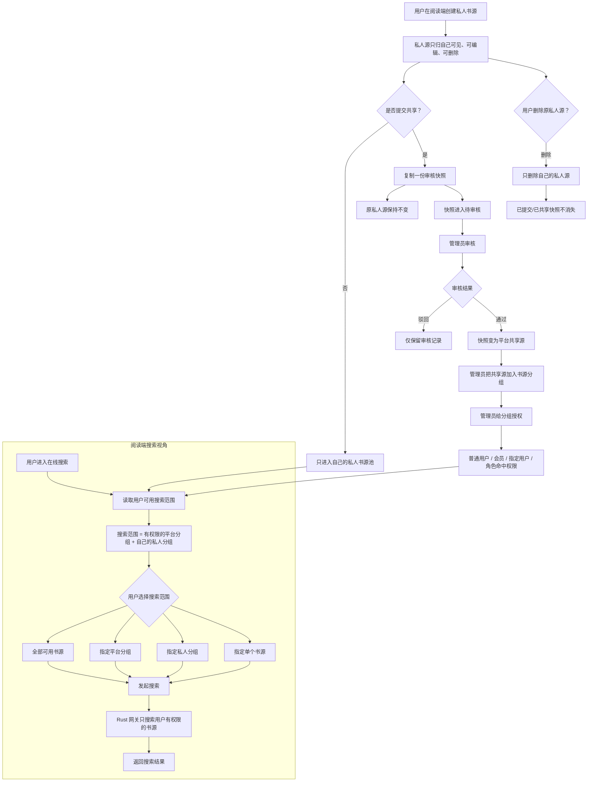

# 书源共享与搜索范围业务流程

更新时间：2026-06-09

本文用于固定阅读端“我的书源、私人分组、提交共享、在线搜索范围”的业务口径。后续改搜索页、我的书源页、私人源检测或跨端适配时，优先按本文核对。

## 项目职责

当前项目：`/Users/zhangyuanlong/storage/FlutterProject/flutterreadbook`

Flutter 阅读端负责：

- 用户创建、编辑、删除、启停私人源。
- 用户维护自己的私人分组。
- 用户提交私人源到共享审核。
- 在线搜索展示“全部可用、平台分组、我的私人分组、单源勾选”。
- 不展示共享源完整 JSON，不提供共享源详情页。

## 核心流程图

## 阅读端展示规则

- “我的书源 -> 分组管理”必须显示 0 源私人分组，方便用户先建分组。
- “在线搜索 -> 搜索范围”隐藏 0 源分组，减少搜索噪音。
- 搜索范围分组需要显示来源：
  - `来源：平台书源`
  - `来源：我的私人书源`
- “全部可用书源”表示当前用户有权限的全部源，不是全平台所有源。
- 共享源列表和搜索范围只展示摘要，不下发完整 JSON。
- 用户删除原私人源，只影响自己的私人源；已提交审核或已共享快照不消失。

## 接口依赖

- Go `/v1/me/book-source-groups`：我的私人分组管理。
- Go `/v1/me/book-sources`：我的私人源列表与 CRUD。
- Go `/v1/me/source-access`：当前用户可用分组和源范围。
- Rust `/api/v1/sources?accessScope=me`：当前用户可搜索的源摘要。
- Rust `/api/v1/books/search`：在线搜索执行。

## 易踩坑

- 搜索范围不是只看 Go 的分组，也不是只看 Rust 的平台源列表；Rust 必须按 Go scope 合并平台源摘要和私人源摘要。
- Go 返回 `group_source_ids` 后，Flutter 会用这些 ID 到 Rust 源列表里找源；Rust 需要从 Go `book_sources.source_json` 补出私人源摘要。
- 私人源新增/编辑后不需要同步 Rust 副本；Rust 运行时读取 Go 表。
- 移动端和桌面端都要使用同一业务数据，但 UI 可以按端适配。
