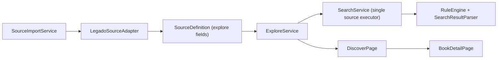

# Legado 发现页兼容实施方案（Explore）

## 1. 背景

当前项目已稳定支持 Legado 书源的主链路：

- 搜索（`searchUrl` + `ruleSearch`）
- 详情（`ruleBookInfo`）
- 目录（`ruleToc`）
- 正文（`ruleContent`）

但对 Legado 的“发现页”能力尚未落地。你提供的书源样本（`2026.2.22_傍晚6.53.txt`）中，发现页字段占比高，且 `QQ阅读` 等关键源依赖：

- `enabledExplore`
- `exploreUrl`
- `ruleExplore`

如果不支持发现页，用户只能搜索，无法使用书源自带分类、榜单、频道导航，体验与开源阅读差距明显。

---

## 2. 目标

### 2.1 产品目标

- 在 App 内新增“发现”入口，支持按书源查看发现分类并拉取书单。
- 发现页书单可进入既有详情页/阅读链路。
- 对不兼容规则给出明确提示，不静默失败。

### 2.2 技术目标 

- 尽量复用现有搜索请求与规则执行能力，避免重复实现。
- 发现能力纳入统一模型、导入、诊断、日志体系。
- 第一阶段优先保证 `QQ阅读` 与常见静态发现规则可用。

### 2.3 验收目标

- 至少 1 个高价值样本（`QQ阅读`）完整跑通：分类 -> 书单 -> 详情。
- 样本集中“静态 discover 规则”兼容率显著提升。

---

## 3. 范围定义

### 3.1 本期范围（Phase 1）

- 基于现有统一 Legado 内核接入发现页，不新增第二套请求/规则执行框架。
- 支持 `exploreUrl` 三种形式：JSON 数组、多行 `title::url`、简单 `@js:`（仅“可直接归约为 JSON 或静态 URL”的轻量场景）。
- 支持 `ruleExplore` 主要字段：`bookList/name/bookUrl/author/intro/coverUrl/lastChapter`。
- 支持发现页分页变量（`{{page}}`, `{{page-1}}`, `{{page+1}}`）。
- UI 支持分类展示、书单展示、分页加载、错误提示。

### 3.2 暂不纳入（Phase 2+）

- 复杂 JS 执行（远程 `Reload(...)`、`eval`、循环抓站脚本）。
- 完整 `exploreScreen` 高级布局策略（先保留字段，不做复杂渲染协议）。
- 多列动态样式的全量还原（先做基础网格策略，样式降级）。

---

## 4. 现状评估

### 4.1 样本数据观察（`2026.2.22_傍晚6.53.txt`）

- 总书源：29
- `enabledExplore=true`：29
- 存在 `exploreUrl`：25
- 存在 `ruleExplore`：29

结论：发现页不是边缘能力，而是主流能力。

### 4.2 当前代码能力

- 已有 `SearchService`、`SearchResultParser`、`RuleEngine`，覆盖请求构建、变量替换、HTML/JSON/Regex 解析。
- 数据库 `sources.rulesJson` 以 JSON 存储规则，不需要新增表或迁移即可扩展规则字段。
- 路由与页面层目前没有发现页入口与页面。

---

## 5. 总体方案

核心原则：**发现页复用搜索内核**。

### 5.1 设计思路

1. 在 `SourceDefinition` 和 `SourceRuleSet` 增加发现相关字段。
2. 在 `LegadoSourceAdapter` 把 `enabledExplore/exploreUrl/ruleExplore` 映射进内部模型。
3. 新增 `ExploreService`：解析 `exploreUrl` 为分类列表（分类标题 + 请求 URL + 样式 hint），将 `ruleExplore` 映射为可执行解析规则，并调用复用后的 `SearchService` 单源执行能力完成书单抓取。
4. 新增 `DiscoverPage` 展示分类与书单，提供翻页与错误提示。
5. 路由接入 `/discover`，从搜索或书架页进入。

### 5.2 模块关系



---

## 6. 数据模型与字段映射

### 6.1 SourceDefinition 扩展

- `exploreEnabled: bool`
- `exploreUrl: String?`
- `supportsExplore: bool`（计算属性）

### 6.2 SourceRuleSet 扩展（发现解析）

- `exploreInitRule`
- `exploreListRule`
- `exploreTitleRule`
- `exploreDetailUrlRule`
- `exploreAuthorRule`
- `exploreIntroRule`
- `exploreCoverUrlRule`
- `exploreLatestChapterRule`
- `exploreKindRule`（预留）
- `exploreWordCountRule`（预留）

### 6.3 Legado 字段映射规则

- `enabledExplore` -> `SourceDefinition.exploreEnabled`
- `exploreUrl` -> `SourceDefinition.exploreUrl`
- `ruleExplore.bookList` -> `SourceRuleSet.exploreListRule`
- `ruleExplore.name` -> `SourceRuleSet.exploreTitleRule`
- `ruleExplore.bookUrl` -> `SourceRuleSet.exploreDetailUrlRule`
- `ruleExplore.author` -> `SourceRuleSet.exploreAuthorRule`
- `ruleExplore.intro` -> `SourceRuleSet.exploreIntroRule`
- `ruleExplore.coverUrl` -> `SourceRuleSet.exploreCoverUrlRule`
- `ruleExplore.lastChapter` -> `SourceRuleSet.exploreLatestChapterRule`
- `ruleExplore.kind` -> `SourceRuleSet.exploreKindRule`
- `ruleExplore.wordCount` -> `SourceRuleSet.exploreWordCountRule`

---

## 7. 发现 URL 解析策略

## 7.1 支持形态

### A. JSON 数组

输入示例：

```json
[{"title":"玄幻","url":"/fenlei/1_{{page}}.html","style":{"layout_flexGrow":1}}]
```

处理：

- 直接 `jsonDecode`
- title/url 必填
- url 为空视为“分组标题”（不可点击）

### B. 多行 `title::url`

输入示例：

```text
玄幻::/xclass/1/{{page}}.html
修真::/xclass/2/{{page}}.html
```

处理：

- 按行拆分，按 `::` 分割
- 左侧为标题，右侧为 URL
- URL 为空时作为不可点击标题项

### C. 简单 `@js:` 场景

处理策略：

- 尝试提取可静态归约的 JSON 字符串结果。
- 归约失败时提示：`该书源发现页依赖复杂 JS，当前版本暂不兼容`。

---

## 8. 发现书单执行策略

### 8.1 复用 SearchService

新增公共方法（示意）：

- `searchSingleSource(...)`

能力：

- 接收自定义规则（发现规则映射后的 parse rules）
- 接收分类 URL 作为请求模板
- 返回标准化 `Book` 列表

### 8.2 发现规则到解析规则映射

- `exploreListRule` -> listRule
- `exploreTitleRule` -> titleRule
- `exploreDetailUrlRule` -> detailUrlRule
- `exploreAuthorRule` -> authorRule
- `exploreIntroRule` -> introRule
- `exploreCoverUrlRule` -> coverUrlRule
- `exploreLatestChapterRule` -> latestChapterRule

### 8.3 变量上下文

发现链路变量集：

- `page`, `pageSize`
- `key/keyword`（默认可留空占位）
- source init 变量（若存在 `exploreInitRule`）

---

## 9. 页面与交互方案

### 9.1 新页面：DiscoverPage

布局分区：

- 顶部：书源选择器 + 返回
- 中部：分类网格（可点击/不可点击区分）
- 底部：书单列表（卡片与搜索页风格一致）

交互流程：

1. 选择书源
2. 加载该源发现分类
3. 选中分类后加载书单（第一页）
4. 上拉加载下一页
5. 点击书目进入详情页

### 9.2 导航入口

- 从搜索页增加“发现”按钮（更符合用户心智：搜索与发现并列）。
- 可选从书架空态增加“去发现”辅助入口。

### 9.3 状态提示

- 无发现配置：`该书源未配置发现页`
- 规则缺失：`发现解析规则不完整`
- 复杂 JS：`发现页依赖复杂脚本，当前版本暂不兼容`
- 网络失败：沿用统一网络错误文案

### 9.4 自适应断点与布局分支（基于 flutter-adaptive-ui）

断点策略（与现有 `AppLayout` 对齐）：

- Compact（手机）：`width < 600`
- Medium（平板/小窗口桌面）：`600 <= width < 840`
- Expanded（桌面/大屏）：`width >= 840`

测量与分支原则：

- 页面级分支使用 `MediaQuery.sizeOf(context).width`。
- 局部网格分支使用 `LayoutBuilder`，根据 `constraints.maxWidth` 动态调整列数。
- 不基于 `Platform.isXxx` 做布局决策，仅依据窗口尺寸。

DiscoverPage 布局分支建议：

- Compact：顶部为单行工具栏（返回 + 书源切换），分类区为 2 列或横向滚动分组条，书单区单列卡片。
- Medium：左侧固定分类面板（约 240 宽），右侧书单区，书单区可启用 2 列卡片（按可读性选择）。
- Expanded：左侧分类面板 + 中间书单 + 右侧详情预览占位（可选，先做占位），内容区限制最大阅读宽度避免超宽行。

分类网格策略（建议）：

- `GridView.extent(maxCrossAxisExtent: ...)` 代替固定列数，减少分辨率适配硬编码。
- `style.layout_flexBasisPercent` 作为 hint：可映射为 tile 的 `crossAxisCellCount` 或 `flex` 权重；不满足时降级为统一尺寸。

### 9.5 输入设备与可访问性（基于 flutter-adaptive-ui）

- 触控优先：核心点击区域满足移动端手势体验。
- 鼠标/触控板：支持 hover 高亮（分类项、书单卡片），保留滚轮与触控板惯性滚动。
- 键盘：分类列表支持方向键焦点移动，回车触发分类加载；书单支持 `Tab` 焦点遍历与回车进入详情。
- 不锁定横竖屏，兼容分屏/多窗口/Foldable。
- 对大屏文本与卡片宽度进行上限约束，避免“全宽铺满”。

### 9.6 UI 复用与组件拆分建议

- 抽象公共数据模型：`DiscoverCategoryItem`（title/url/style/clickable）、`DiscoverBookCardData`（与 `Book` 显示字段映射）。
- 抽象可复用组件：`DiscoverSourceSelector`、`DiscoverCategoryPane`、`DiscoverBookList`。
- 与既有页面复用视觉资产：书单卡片样式与 `SearchPage` 统一，间距与断点常量复用 `AppLayout` / `AppSpacing`。

---

## 10. 兼容性分级

### 10.1 FULL（完全兼容）

- `exploreUrl` 为 JSON/多行静态形式
- `ruleExplore` 关键字段齐全
- 无复杂 JS/Reload 依赖

### 10.2 PARTIAL（部分兼容）

- `exploreUrl` 可解析，但样式/部分字段降级
- `ruleExplore` 存在少量字段缺失（可展示最小书单）

### 10.3 UNSUPPORTED（暂不兼容）

- 发现入口或规则严重缺失
- 强依赖复杂 JS/Reload 且无法静态归约

---

## 11. 实施拆解（文件级）

### 11.1 Domain / Data

- `lib/domain/entities/source_definition.dart`
- 新增发现字段与序列化逻辑
- `lib/data/adapters/legado_source_adapter.dart`
- 增加 discover 字段映射

### 11.2 Service

- `lib/features/search/application/search_service.dart`
- 暴露单源执行公共能力（给发现页复用）
- 新增：`lib/features/discover/application/explore_service.dart`
- 分类解析 + 发现书单请求编排

### 11.3 Presentation

- 新增：`lib/features/discover/presentation/discover_page.dart`
- `lib/app/router.dart`
- 注册 `/discover`
- `lib/features/search/presentation/search_page.dart`
- 增加发现入口

### 11.4 测试

- `test/data/adapters/legado_source_adapter_test.dart`
- discover 字段映射单测
- 新增：`test/features/discover/application/explore_service_test.dart`
- exploreUrl 解析与请求编排测试
- `test/domain/entities/source_definition_test.dart`
- discover 字段序列化 roundtrip

---

## 12. 测试方案

### 12.1 单元测试

- `exploreUrl` 解析：
- JSON 数组
- `title::url` 多行
- 空行/异常行容错
- discover 规则映射完整性：
- `ruleExplore` 各字段映射准确
- `enabledExplore` 行为正确

### 12.2 集成测试

- 以 `QQ阅读` 书源为主样本：
- 可加载分类
- 可拉取书单
- 可进入详情页
- 分页成功（`{{page}}` 生效）

### 12.3 回归测试

- 搜索/详情/目录/正文现有链路无行为回归
- 书源导入性能无明显退化

---

## 13. 里程碑与工期建议

### M1（0.5-1 天）：模型与导入

- 数据模型扩展
- adapter 映射补齐
- 基础单测

### M2（1-1.5 天）：发现服务

- `exploreUrl` 解析器
- 书单抓取编排
- 错误分级文案

### M3（1-1.5 天）：页面与路由

- DiscoverPage
- 入口接入
- 交互完善

### M4（0.5-1 天）：联调回归

- `QQ阅读` 样本验证
- 回归与文档更新

总计建议：**3-5 天**（不含复杂 JS 引擎能力）。

---

## 14. 风险与应对

### 风险 1：复杂 JS discover 无法执行

- 应对：先分级提示 + 保留降级路径，不阻断其他书源。

### 风险 2：discover 规则多样化导致解析分支过多

- 应对：先覆盖高频静态场景，逐步扩展并配套样本测试。

### 风险 3：新增页面导致导航复杂度上升

- 应对：入口先放搜索页，避免底部导航改动。

---

## 15. 验收清单

- 书源导入后可识别发现能力（配置正确显示“可发现”）。
- 发现页可按书源显示分类。
- 分类点击可拉书单并分页。
- 书单可进入现有详情页。
- 对不兼容 discover 规则有明确提示。
- 现有搜索/详情/目录/正文链路无回归。

---

## 16. 下一阶段（Phase 2）预研方向

- 受限 JS Runtime 接入（仅 Discover 场景开关验证）。
- `Reload(...)` 缓存与安全策略（TTL、域名白名单、超时）。
- `exploreScreen` 高级布局协议兼容。

---

## 17. 实施前确认事项

- 发现入口放置位置是否仅在搜索页，还是同时放到书架页。
- 第一阶段是否要求支持“分组标题样式”完整还原（如 `layout_flexBasisPercent` 精细控制）。
- 对复杂 JS discover 的产品策略：
- 仅提示“不兼容”
- 或增加“尝试降级执行”开关（不保证稳定）
- 回归样本是否固定以 `QQ阅读` + 2 个静态站源作为发布门槛。
