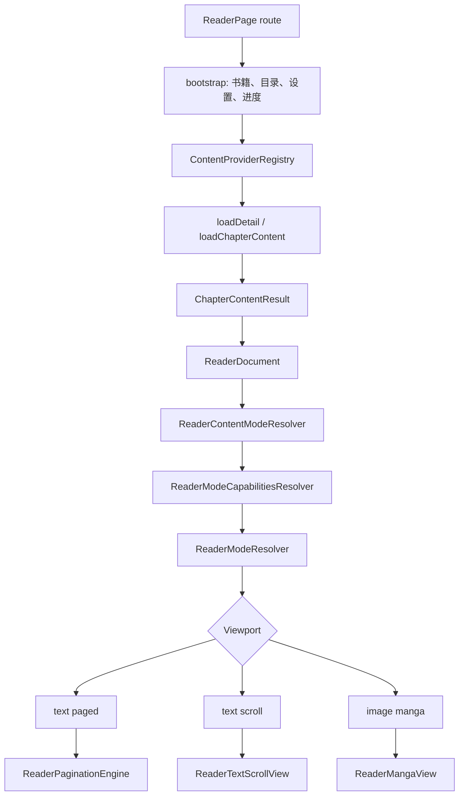

# 阅读器整体架构差距与吸收改造计划

日期：2026-05-09

参考对象：

- 当前项目：`lib/features/reader/`
- MD3/Legado：`/Users/zhangyuanlong/Downloads/legado-with-MD3-main`
- 配套计划：`docs/reader_low_resource_execution_plan_2026-05-09.md`

本文目标不是照搬 MD3，而是把当前阅读器里“功能能跑但细节没有对应上”的地方梳理清楚，提炼可吸收的设计点，并拆成不会失控的阶段任务。

---

## 1. 当前阅读器主链路

当前项目阅读器大致链路如下：

已有基础：

- 本地和网络内容统一通过 `ContentProvider`
- EPUB/TXT/HTML/Markdown/PDF/Kindle 等本地入口已有解析器
- `ReaderDocument` 已有结构化 block，能表达标题、正文、列表、引用、脚注和图片
- 文本分页、文本滚动、漫画视图、自动阅读、阅读记录、换源、缓存等能力都有实现
- 漫画已有 `continuous / paged / horizontal` 三种模式
- 阅读页已经抽出了很多 resolver/controller/presenter，说明重构方向是对的

主要问题：

- `ReaderPage` 仍然是运行时总控，state 字段、timer、token、分页、预加载、记录保存、漫画状态都集中在页面层
- `reader_page.dart` 与 `reader_page_content_loading.dart` 中旧链路和 `Flow` 链路并存，迁移没有完全收敛
- 文本分页还是 paragraph/slice 模型，不能承载图片块和图文混排
- 图文章节被策略层强制退回滚动正文，无法像 MD3 一样分页展示
- 滚动和分页已经区分，但章节窗口、预加载、任务取消和资源预算没有形成统一会话模型
- 图片解码、缓存、预载、回收没有按正文插图、漫画、封面拆预算
- 缓存清理仍偏条数限制，缺少字节预算和设备档位
- 低频记录和信息栏已有意识，但还没有形成统一后台任务策略

---

## 2. MD3 值得吸收的设计点

### 2.1 阅读核心是会话，不是页面状态

MD3 的 `ReadBook` 虽然是 Kotlin object，但它承担的是阅读会话职责：

- 当前书籍和目录状态
- `prevTextChapter / curTextChapter / nextTextChapter` 三章窗口
- 章节加载 job 管理和取消
- 预下载并发限制
- 阅读记录自动保存
- 切章时复用已加载章节

我们当前对应逻辑分散在：

- `ReaderPage` state 字段
- `_chapterContentRequestToken`
- `_preloadTaskToken`
- `_paginationTaskId`
- `_continuousTextChapters`
- `_progressDebounceTimer`
- `_readingRecordAutoCommitTimer`

需要吸收的点：

- 新增 `ReaderSessionController` 或 `ReaderChapterWindowController`
- 页面只订阅 session state 和发 intent
- 章节加载、预加载、取消、切章、阅读记录启动/提交从页面层下沉
- 所有后台任务必须挂在阅读会话生命周期下统一取消

### 2.2 章节窗口必须有明确边界

MD3 始终围绕当前章维护前、当前、后一章；切章时移动引用，而不是无限堆积。

当前项目：

- 文本滚动流 `_continuousTextChapters` 会追加前后章节，但窗口边界不够显式
- 普通预加载会向前 2 章、书架中向前 10 章缓存
- 分页预热也在预加载中做，和章节内容预加载耦合

需要吸收的点：

- 正文展示窗口固定为 `prev/current/next`
- 缓存预下载可以有更大范围，但必须是低优先级后台任务
- UI 强持有章节和磁盘缓存章节要区分
- 离开窗口的章节要释放正文、分页结果、图片状态和缩放状态

### 2.3 分页器要从整章结果变成逐页流

MD3 的 `TextChapterLayout` 逐页完成后通过 channel/listener 通知 UI，当前页附近可用就能显示。

当前项目：

- `ReaderPaginationEngine.paginateParagraphs()` 最终返回整章 `ReaderPaginationResult`
- 中间虽有 yield 和 abort，但 UI 仍等完整 `pages`
- 邻章分页预热也是整章分页

需要吸收的点：

- 新增 streaming pagination：`pageReady / nearbyReady / complete`
- 当前阅读位置附近优先排
- 长章节不等整章分页完成
- 缓存写入延后到完整或稳定片段
- 分页任务可按章节窗口和签名统一取消

### 2.4 图文混排必须进入分页模型

MD3 的 `TextChapterLayout` 不只排文字，还会处理：

- HTML
- ``
- 图片尺寸
- 图片样式：full / single / text 等
- 图片页、文字页、图文页

当前项目：

- `EpubLocalBookParser` 已经能抽图片并写入 `ReaderImageBlock`
- `ReaderTextScrollView` 可以渲染 `ReaderRenderImageItem`
- `ReaderTextPagedView` 只认识 `ReaderPagedSlice`
- `ReaderModeCapabilitiesResolver` 对带插图正文设置 `canUsePagedText = false`
- `ReaderAnimationPolicyResolver` 明确提示带插图退回滚动正文

需要吸收的点：

- 分页模型从 `ReaderPagedSlice` 扩展为 `ReaderPagedBlock`
- `ReaderPagedTextBlock` 继续承载文字切片
- `ReaderPagedImageBlock` 承载图片、原始尺寸、显示尺寸、占位高度
- 滚动和分页共用 `ReaderDocument` block 数据
- 带插图章节不再天然禁止分页，而由 block 分页器判断是否可分页
- 图片过大时分页器应降级为独页图片或保守占位

### 2.5 滚动是布局/交互模式，不是动画

MD3 把 `scroll` 放在 `PageAnim` 里，但实际切到了 `ScrollPageDelegate`，它改变的是交互和布局行为。

当前项目已经有：

- `ReaderLayoutMode.paged/scroll`
- `ReaderModeViewportKind.textPaged/textScroll/imagePaged/imageScroll`

需要继续坚持：

- `scroll` 不再进入 `pageAnimationStyle`
- page animation 只描述 paged text 下的 cover/slide/fade/curl/none
- 滚动模式要有独立的点击翻页距离、边界切章、预加载策略
- 图片页滚动距离和文字页滚动距离应不同，MD3 对图片页使用可视高度，对文字保留一行上下文

### 2.6 漫画是图片阅读器，不是正文滚动的副产品

MD3 对漫画有独立 UI 和 RecyclerView/Glide 预载回收逻辑；普通 ReadBook 中图片类也默认滚动。

当前项目：

- `ReaderMangaView` 已支持连续、分页、横向
- 有基础缩放和重试
- 但图片缓存、cache extent、缩放 controller、低端档位策略还不够系统

需要吸收的点：

- 漫画模式单独预算图片缓存
- 当前页、前页、后页之外释放重型状态
- 连续模式按设备档位调整 `cacheExtent`
- 网络漫画、EPUB 纯图、本地图片类章节应共享图片阅读核心
- 图文 EPUB 不应强行转漫画，除非章节是纯图片

### 2.7 预下载要小并发、可取消、有失败记忆

MD3 预下载：

- 非本地才预下载
- semaphore 限制并发为 2
- 当前章前后有限范围
- 失败次数有限
- 退出阅读清理任务

当前项目：

- 阅读页内 `_preloadNeighborsFlow` 顺序预加载
- 书架中会向前缓存 10 章
- 分页预热和内容预加载耦合
- 失败记忆和资源档位不明显

需要吸收的点：

- 新增 `ReaderPreloadController`
- 内容预加载、分页预热、图片预载拆任务类型
- 任务按资源预算分优先级
- 低电量/低端机/移动网络降低或关闭邻章预热
- 失败章节有短期失败记忆，避免反复拉取

### 2.8 阅读记录和信息栏要低唤醒

MD3 阅读记录：

- 自动保存间隔 120 秒
- 最短阅读时长 10 秒
- 时间电量通过系统 tick/broadcast

当前项目：

- 阅读记录 auto commit 已是 2 分钟
- progress save 有 420ms debounce
- 信息栏 30 秒 timer 轮询
- battery_plus 获取电量

需要吸收的点：

- 阅读记录提交保持分钟级
- 进度保存按交互完成、切章、离开页面等关键点触发，减少滚动中频繁写
- 信息栏只在显示时启动 tick
- 支持平台事件时优先用平台事件，Flutter 侧低频兜底
- 页面不可见、低电量、息屏时暂停非必要任务

### 2.9 缓存要从条数走向字节预算

MD3 有全局内存 LRU 和字体 LRU；图片交给 Glide 体系。

当前项目：

- 分页缓存内存 LRU 24 条
- 分页磁盘缓存按条数清理
- 封面缓存按条数清理
- 章节缓存按条数清理
- 大章节、大图、大 data URI 可能绕过条数限制

需要吸收的点：

- 统一 `ReaderResourceBudget`
- 章节正文、分页缓存、图片缓存、封面缓存分预算
- 清理策略支持条数、字节、最后访问时间
- 低端机档位降低内存 entry 和 image cache 上限
- data URI 图片设置大小阈值，超限落盘或拒绝内存解码

---

## 3. 分阶段改造计划

### 阶段 0：基线与回归样本

目标：

- 先固定可验证基线，避免改造时不知道是否变好。

任务：

- [ ] 准备 6 类样本：长 TXT、普通 EPUB、图文 EPUB、纯图 EPUB/漫画、网络章节、低质量图片章节
- [ ] 建立打开耗时、首屏耗时、首翻页耗时、内存峰值、连续滚动帧率、后台任务数基线
- [ ] 增加图文 EPUB smoke test：滚动可见文字和图片
- [ ] 增加纯漫画 smoke test：连续、分页、横向三模式可用
- [ ] 记录当前已知限制：图文 EPUB 只能滚动，不能正文分页

完成标准：

- 每类样本有固定文件或固定 mock
- 每项指标有记录口径
- 后续阶段必须回填指标变化

### 阶段 1：阅读会话与页面职责收口

目标：

- 让 `ReaderPage` 从运行时总控变成 UI 壳层。

任务：

- [ ] 新增 `ReaderSessionController`
- [ ] 新增 `ReaderSessionIntent`：load、jump、next、previous、changeMode、changeSettings、retry
- [ ] 下沉 `_chapterContentRequestToken`
- [ ] 下沉 `_preloadTaskToken`
- [ ] 下沉 `_paginationTaskId`
- [ ] 下沉阅读记录 session 生命周期
- [ ] 收敛 `reader_page.dart` 与 `reader_page_content_loading.dart` 中重复的旧链路和 Flow 链路
- [ ] 页面只保留 UI controller：ScrollController、PageController、AnimationController、Selection controller

阶段边界：

- 不改功能表现
- 不改分页算法
- 不改缓存策略

完成标准：

- 章节加载、预加载、分页任务取消可以单测
- `ReaderPage` state 字段明显减少
- 旧链路和 Flow 链路不再重复维护

### 阶段 2：三章窗口与任务生命周期

目标：

- 建立 MD3 式 `prev/current/next` 展示窗口。

任务：

- [ ] 新增 `ReaderChapterWindowController`
- [ ] 窗口固定持有前、当前、后三章
- [ ] 切下一章时复用 next 为 current
- [ ] 切上一章时复用 prev 为 current
- [ ] 取消窗口外章节加载任务
- [ ] 释放窗口外分页结果、图片状态、缩放状态
- [ ] 区分 UI 窗口和后台缓存预下载范围

阶段边界：

- 不做图文分页
- 不扩大预下载范围

完成标准：

- 快速连跳章节不会让旧任务写回 UI
- 任意时刻 UI 强持有章节不超过三章
- 滚动连续章节不会无限增长

### 阶段 3：block-based 图文分页

目标：

- 让 EPUB 图文混排可以进入分页模式。

任务：

- [ ] 新增 `ReaderPagedBlock`
- [ ] 新增 `ReaderPagedTextBlock`
- [ ] 新增 `ReaderPagedImageBlock`
- [ ] 为图片块解析尺寸、显示尺寸和占位高度
- [ ] 将 `ReaderPaginationEngine` 从 paragraph 输入升级为 block 输入
- [ ] 保留 `ReaderPagedSlice` 作为文本块内部结构
- [ ] `ReaderTextPagedView` 支持文字块和图片块混排
- [ ] 移除“带插图章节强制滚动”的硬限制，改为由分页器能力判断
- [ ] 图文分页失败时可降级滚动，并给出内部诊断原因

阶段边界：

- 不做复杂图片缩放
- 不做漫画 UI 重设计
- 不做 Picture 缓存

完成标准：

- 图文 EPUB 可在分页模式显示文字和图片
- 图文 EPUB 滚动模式仍正常
- 大图不会撑爆页面或导致明显 OOM

### 阶段 4：流式分页与当前页优先

目标：

- 长章节和图文章节不等整章分页完成才显示。

任务：

- [ ] 新增 `ReaderStreamingPaginationController`
- [ ] 输出 `pageReady / nearbyReady / complete`
- [ ] 当前阅读位置附近优先排
- [ ] UI 可在当前页 ready 后先显示
- [ ] 整章完成后再写分页缓存
- [ ] 设置变化、章节变化、窗口变化时取消旧分页

阶段边界：

- 不承诺 isolate 排版
- 不引入重型渲染缓存

完成标准：

- 长章节首屏可见时间下降
- 快速改字号、切章不会出现旧分页污染
- 当前页可用后 UI 先显示

### 阶段 5：漫画与图片资源治理

目标：

- 保留漫画能力，同时降低低端机内存峰值。

任务：

- [ ] 正文插图、漫画图、封面图拆分预算
- [ ] 图片统一计算 `cacheWidth/cacheHeight`
- [ ] 按设备档位调整 Flutter `ImageCache` 上限
- [ ] 连续漫画按档位调整 `cacheExtent`
- [ ] 漫画分页只保留当前页、前页、后页的重型状态
- [ ] 离开可视窗口释放 zoom controller 和临时状态
- [ ] data URI 设置大小阈值
- [ ] 为本地 file、网络图、data URI、svg 建立统一图片请求模型

阶段边界：

- 不增加新漫画模式
- 不改阅读设置 UI 大结构

完成标准：

- 漫画连续滚动内存峰值下降
- 图文 EPUB 大图不造成明显尖峰
- 低端档位图片缓存更保守

### 阶段 6：预加载、预下载和缓存预算

目标：

- 把“读得顺”和“省资源”统一到资源策略里。

任务：

- [ ] 新增 `ReaderResourceBudget`
- [ ] 新增 `ReaderPreloadController`
- [ ] 拆分内容预加载、分页预热、图片预载
- [ ] 设置并发上限和失败记忆
- [ ] 低电量/低端机/移动网络降级预热
- [ ] 章节缓存、分页缓存、图片缓存支持字节预算
- [ ] 后台预下载不能影响当前章加载优先级

阶段边界：

- 不改业务缓存语义
- 不改变用户手动缓存入口

完成标准：

- 后台任务可统一取消
- 低资源档位下预热任务明显减少
- 缓存清理可按字节收敛

### 阶段 7：低唤醒与生命周期治理

目标：

- 降低长时间阅读的无意义唤醒。

任务：

- [ ] 信息栏只在显示时启动 tick
- [ ] 电量优先平台事件，Flutter 侧低频兜底
- [ ] 页面不可见时暂停非必要 timer
- [ ] 进度保存从滚动高频触发改为关键点触发加节流
- [ ] 阅读记录继续保持分钟级提交
- [ ] 自动阅读、音量键、系统亮度、系统 UI 统一挂到 session lifecycle

阶段边界：

- 不改变阅读记录统计口径

完成标准：

- 长时间停留唤醒次数下降
- 后台后无多余阅读器 timer
- 退出阅读时任务和监听全部释放

---

## 4. 优先级建议

推荐顺序：

1. 阶段 0：先补基线
2. 阶段 1：收口阅读会话
3. 阶段 2：三章窗口
4. 阶段 3：图文分页
5. 阶段 4：流式分页
6. 阶段 5：图片资源治理
7. 阶段 6：预加载和缓存预算
8. 阶段 7：低唤醒

原因：

- 不先收口会话，后面所有功能都会继续堆在 `ReaderPage`
- 不先建三章窗口，图文分页和图片资源治理会放大内存压力
- 不先让分页模型支持 block，EPUB 图文只能停留在滚动展示
- 不做图片预算，漫画和图文分页在低端机上会互相拖累

---

## 5. 不建议吸收的点

- 不照搬 MD3 的全局 singleton 形态，Flutter/Riverpod 更适合显式 provider 和 controller 生命周期
- 不照搬 Android `CanvasRecorder`，Flutter 侧要谨慎评估 `RepaintBoundary` 和图片缓存压力
- 不照搬 Glide，Flutter 侧应通过 `ImageProvider`、`cacheWidth/cacheHeight`、`ImageCache` 和可视窗口控制实现
- 不把滚动当成动画样式继续塞进 page animation
- 不把图文 EPUB 强行转漫画模式

---

## 6. 验收总口径

最终阅读器应满足：

- 文本小说：分页、滚动、动画稳定，长章节首屏快
- 图文 EPUB：分页和滚动都能展示文字加图片
- 纯漫画/纯图片：连续、分页、横向可用，低端机内存可控
- 本地书：打开快，解析、索引、图片落盘不阻塞首屏
- 网络书：当前章优先，预加载不抢资源，失败可恢复
- 阅读记录：准确但低频
- 缓存：按字节预算可控
- 页面层：只做 UI 和交互，不做阅读核心调度

