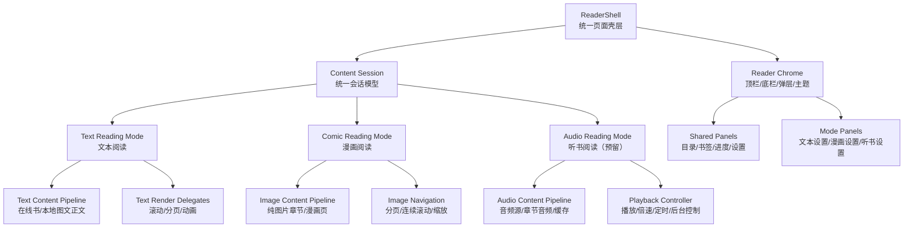

# 阅读器多内容形态统一规划

更新时间：2026-04-07  
用途：面向当前文本阅读、漫画阅读，以及未来听书能力，统一规划阅读器壳层、内容内核、界面分层与动画策略。

## 1. 结论先行

当前阅读器的方向不应该是：

- 把所有内容类型都塞进一个越来越大的 `ReaderPage`
- 继续按“功能来了就往页面里加状态”的方式演进

更合理的方向是：

- 保留一个统一的“阅读器壳层”
- 将内容类型拆成独立的“内容模式”
- 将每种模式的状态、动作、动画、工具栏差异控制在各自边界内

一句话总结：

- **壳层统一**
- **内容模式分治**
- **高频交互一致**
- **内容特有能力独立**

## 2. 当前问题

当前阅读器已经比早期结构收口很多，但如果考虑未来听书能力，还存在几个明显风险：

1. 文本分页、文本滚动、漫画阅读虽然已经部分委托化，但仍共享过多页面状态。
2. 在线书与本地图书虽然共用页面壳，但数据准备链仍较重，后续再加听书时容易继续膨胀。
3. 阅读主路径与书籍操作路径还没有彻底分层，缓存、换源、详情、书架等仍会影响阅读器设计判断。
4. 动画目前主要围绕文本分页设计，未来音频播放并不需要这些动画语义，强行共用会增加复杂度。

## 3. 目标

本次规划目标：

- 为当前文本阅读与漫画阅读定义统一的阅读器壳层
- 为未来听书模式预留独立内容模式与控制面板
- 明确哪些能力是所有模式共享，哪些能力必须模式特化
- 避免未来“听书接入”把当前文本阅读器重新打散

非目标：

- 本轮不直接实现听书功能
- 不在当前阶段重做整套视觉设计
- 不强行把漫画并入文本阅读内核

## 4. 总体架构



## 4.1 当前代码映射

当前仓库里其实已经有不少可以直接对应三层模型的代码，只是还没有被正式归档成统一口径。

### ReaderShell 候选映射

当前更接近壳层职责的代码：

- [reader_page.dart](/Users/zhangyuanlong/storage/FlutterProject/flutterreadbook/lib/features/reader/presentation/reader_page.dart)
- [reader_route.dart](/Users/zhangyuanlong/storage/FlutterProject/flutterreadbook/lib/features/reader/presentation/reader_route.dart)
- [reader_catalog_sheet.dart](/Users/zhangyuanlong/storage/FlutterProject/flutterreadbook/lib/features/reader/presentation/reader_catalog_sheet.dart)
- [chapter_cache_sheets.dart](/Users/zhangyuanlong/storage/FlutterProject/flutterreadbook/lib/features/reader/presentation/chapter_cache_sheets.dart)

这层当前实际承担：

- 路由入口与页面生命周期
- overlay 显隐
- 底部菜单与弹层打开关闭
- 阅读页级别的手势、音量键、系统 UI 管理
- 书籍身份与章节身份的页面级持有

### ReaderContentSession 候选映射

当前更接近会话层职责的代码：

- [reader_session_state.dart](/Users/zhangyuanlong/storage/FlutterProject/flutterreadbook/lib/features/reader/application/reader_session_state.dart)
- [reader_session_state_resolver.dart](/Users/zhangyuanlong/storage/FlutterProject/flutterreadbook/lib/features/reader/application/reader_session_state_resolver.dart)
- [reader_logical_position.dart](/Users/zhangyuanlong/storage/FlutterProject/flutterreadbook/lib/features/reader/application/reader_logical_position.dart)
- [reader_chapter_flow.dart](/Users/zhangyuanlong/storage/FlutterProject/flutterreadbook/lib/features/reader/application/reader_chapter_flow.dart)
- [reader_chapter_navigation.dart](/Users/zhangyuanlong/storage/FlutterProject/flutterreadbook/lib/features/reader/application/reader_chapter_navigation.dart)
- [reader_jump_planner.dart](/Users/zhangyuanlong/storage/FlutterProject/flutterreadbook/lib/features/reader/application/reader_jump_planner.dart)
- [reader_jump_facade.dart](/Users/zhangyuanlong/storage/FlutterProject/flutterreadbook/lib/features/reader/application/reader_jump_facade.dart)
- [reader_reading_record_coordinator.dart](/Users/zhangyuanlong/storage/FlutterProject/flutterreadbook/lib/features/reader/application/reader_reading_record_coordinator.dart)

这层当前实际承担：

- 当前章节身份
- 逻辑阅读位置
- 当前可见位置
- 渲染模式标识
- 自动阅读 / 切章中等会话态
- 目录跳转、书签跳转、跨章跳转的统一入口

### ReadingMode 候选映射

当前更接近模式层职责的代码：

文本模式：

- [reader_document_render_model.dart](/Users/zhangyuanlong/storage/FlutterProject/flutterreadbook/lib/features/reader/application/reader_document_render_model.dart)
- [text_reader_renderer.dart](/Users/zhangyuanlong/storage/FlutterProject/flutterreadbook/lib/features/reader/application/text_reader_renderer.dart)
- [chapter_content_service.dart](/Users/zhangyuanlong/storage/FlutterProject/flutterreadbook/lib/features/reader/application/chapter_content_service.dart)
- [content_text_cleaner.dart](/Users/zhangyuanlong/storage/FlutterProject/flutterreadbook/lib/features/reader/application/content_text_cleaner.dart)

来源模式切换：

- [content_provider.dart](/Users/zhangyuanlong/storage/FlutterProject/flutterreadbook/lib/features/reader/application/content_provider.dart)
- [source_content_provider.dart](/Users/zhangyuanlong/storage/FlutterProject/flutterreadbook/lib/features/reader/application/source_content_provider.dart)
- [local_content_provider.dart](/Users/zhangyuanlong/storage/FlutterProject/flutterreadbook/lib/features/reader/application/local_content_provider.dart)

本地文本链：

- [local_book_detail_service.dart](/Users/zhangyuanlong/storage/FlutterProject/flutterreadbook/lib/features/book/application/local_book_detail_service.dart)
- [local_chapter_content_service.dart](/Users/zhangyuanlong/storage/FlutterProject/flutterreadbook/lib/features/reader/application/local/local_chapter_content_service.dart)
- [local_book_index_service.dart](/Users/zhangyuanlong/storage/FlutterProject/flutterreadbook/lib/features/reader/application/local/local_book_index_service.dart)

文本阅读辅助能力：

- [reader_auto_read_coordinator.dart](/Users/zhangyuanlong/storage/FlutterProject/flutterreadbook/lib/features/reader/application/reader_auto_read_coordinator.dart)
- [chapter_cache_service.dart](/Users/zhangyuanlong/storage/FlutterProject/flutterreadbook/lib/features/reader/application/chapter_cache_service.dart)
- [reader_source_switch_coordinator.dart](/Users/zhangyuanlong/storage/FlutterProject/flutterreadbook/lib/features/reader/application/reader_source_switch_coordinator.dart)
- [reader_catalog_search_service.dart](/Users/zhangyuanlong/storage/FlutterProject/flutterreadbook/lib/features/reader/application/reader_catalog_search_service.dart)

### 当前阶段的结构判断

当前代码实际状态可以概括成：

- 已经有 `ReaderShell` 雏形，但仍然大部分逻辑堆在 `ReaderPage`
- 已经有 `ReaderContentSession` 雏形，但还没有被独立命名成统一会话对象
- 文本模式已经最接近独立模式层
- 本地书 / 在线书已经通过 `ContentProvider` 做来源分流
- 漫画仍然主要内嵌在 `ReaderPage` 中
- 听书在当前阅读器代码中还没有正式模式层实现

## 5. 三层模型

### 5.1 壳层 `ReaderShell`

职责：

- 承载统一路由入口
- 管理页面级生命周期
- 管理全局 overlay、工具栏显示、弹层打开关闭
- 管理跨模式共享的书籍身份信息

壳层应该知道：

- 当前书籍是谁
- 当前 source 是谁
- 当前内容模式是什么
- 当前是否在阅读、缓存、换源、播放

壳层不应该直接知道：

- 分页如何翻页
- 漫画如何缩放
- 听书如何拖动进度条

### 5.2 会话层 `Content Session`

职责：

- 抽象“当前这本作品的内容会话”
- 统一承载：
  - `bookId`
  - `sourceId`
  - `detailUrl`
  - `chapter identity`
  - 模式级状态

建议后续统一成：

- `ReaderContentSession`

其中包含：

- `contentMode`
  - `text`
  - `comic`
  - `audio`
- `book identity`
- `chapter identity`
- `progress identity`
- `source/runtime identity`

### 5.3 模式层 `Reading Mode`

每种内容模式维护自己的：

- 数据准备逻辑
- 渲染逻辑
- 交互逻辑
- 特有设置

当前建议明确分为：

- `TextReadingMode`
- `ComicReadingMode`
- `AudioReadingMode`

## 5.4 阶段 B：当前状态归类表

结合 [reader_page.dart](/Users/zhangyuanlong/storage/FlutterProject/flutterreadbook/lib/features/reader/presentation/reader_page.dart) 当前状态字段，阶段 B 先把状态按去向归类，避免继续把所有东西都堆在页面 State 上。

### A. 应留在 `ReaderShell` 的状态

| 当前字段/对象 | 归类 | 原因 |
| --- | --- | --- |
| `_showOverlayControls` | `ReaderShell` | 这是页面壳的显隐状态，不属于内容会话 |
| `_isBootstrapping` | `ReaderShell` | 页面级初始化流程状态 |
| `_isLoadingContent` | `ReaderShell` | 当前页面是否在展示正文加载过程 |
| `_errorText` | `ReaderShell` | 页面级错误展示入口 |
| `_isSystemUiVisible` | `ReaderShell` | 纯壳层系统 UI 控制 |
| `_volumeKeyEventSubscription` / `_isVolumeKeyPageInterceptionEnabled` | `ReaderShell` | 设备输入桥接，不属于阅读内容本身 |
| `_overlayControlsController` / `_pagedTransitionController` / `_curlAutoTurnController` | `ReaderShell` | 全是页面动画控制器 |
| `_lastReaderSnackAt` / `_lastReaderSnackKey` | `ReaderShell` | 页面级提示去重 |
| `_bookmarkToolbarEntry` | `ReaderShell` | overlay entry 生命周期属于壳层 |

### B. 应进入 `ReaderContentSession` 的状态

| 当前字段/对象 | 归类 | 原因 |
| --- | --- | --- |
| `_activeBookId` | `ReaderContentSession` | 作品身份 |
| `_sourceId` / `_detailUrl` | `ReaderContentSession` | 当前内容来源身份 |
| `_chapterId` / `_chapterUrl` / `_chapterTitle` | `ReaderContentSession` | 当前章节身份 |
| `_chapters` / `_currentIndex` | `ReaderContentSession` | 当前目录与章节定位 |
| `_bookTitle` / `_bookAuthor` / `_bookCoverUrl` | `ReaderContentSession` | 当前作品上下文 |
| `_bootstrapProgress` | `ReaderContentSession` | 启动阶段承接的阅读进度快照 |
| `ReaderSessionState` | `ReaderContentSession` | 当前已经是最接近会话层的现成对象 |
| `_activeReadingRecordSession` | `ReaderContentSession` | 它本质上是当前阅读会话的衍生记录状态 |

### C. 应留在文本模式 `TextReadingMode` 的状态

| 当前字段/对象 | 归类 | 原因 |
| --- | --- | --- |
| `_document` | `TextReadingMode` | 文本文档模型 |
| `_content` / `_paragraphs` | `TextReadingMode` | 文本渲染输入 |
| `_chapterImageUrls` / `_chapterImageHeaders` | `TextReadingMode` | 正文插图 / 图片正文输入 |
| `_pagedPages` / `_currentPageIndex` | `TextReadingMode` | 分页渲染状态 |
| `_pagedPaginationState` / `_paginationTaskId` | `TextReadingMode` | 分页布局任务状态 |
| `_scrollController` | `TextReadingMode` | 滚动文本渲染控制器 |
| `_isAutoReadRunning` / `_isAutoReadSessionEnabled` / `_isAutoReadAdvancingChapter` | `TextReadingMode` | 自动阅读只直接服务文本模式 |
| `_precomputedChapterLayouts` / `_continuousTextChapters` | `TextReadingMode` | 连续文本阅读布局缓存 |

### D. 应留在漫画模式 `ComicReadingMode` 的状态

| 当前字段/对象 | 归类 | 原因 |
| --- | --- | --- |
| `_mangaPageController` | `ComicReadingMode` | 漫画分页控制器 |
| `_mangaPageIndex` | `ComicReadingMode` | 漫画当前页 |
| `_mangaImageRetryNonce` | `ComicReadingMode` | 漫画图片重试状态 |
| `_mangaTransformControllers` | `ComicReadingMode` | 漫画缩放状态 |
| `_mangaDoubleTapDetails` | `ComicReadingMode` | 漫画双击缩放手势状态 |
| `_mangaZoomedPageIndexes` | `ComicReadingMode` | 漫画页缩放集合 |

### E. 应继续留在辅助服务或外部协调器的状态

| 当前字段/对象 | 归类 | 原因 |
| --- | --- | --- |
| `_settings` | `ReaderShell + 持久化服务` | 它是共享设置，不是单次内容会话专属 |
| `_isSwitchSourceLoading` / `_isAutoSwitchingSource` | `ReaderShell + SourceSwitchCoordinator` | 它们是动作执行态，不是阅读内容本身 |
| `_isCurrentChapterCached` | `ChapterCacheService` 衍生态 | 更适合作为缓存能力反馈 |
| `_isShelfActionLoading` / `_isInBookshelf` | `BookshelfService` 衍生态 | 作品运营关系，不应塞进内容模式 |
| `_customFonts` / `_customBackgroundImages` | `ReaderShell + Preferences` | 这是外观资源，而不是内容会话 |
| `_readerBatteryLevel` / `_readerInfoNow` | `ReaderShell` | 信息栏环境数据 |

## 5.5 `ReaderContentSession` 草案

阶段 B 建议把当前会话层正式定义成一个清晰对象，哪怕先只作为文档契约。

```dart
class ReaderContentSession {
  final ReaderContentMode contentMode;

  final String bookId;
  final String sourceId;
  final String detailUrl;
  final String bookTitle;
  final String? bookAuthor;
  final String? bookCoverUrl;

  final String chapterId;
  final String? chapterUrl;
  final String? chapterTitle;
  final int? chapterIndex;
  final List<Chapter> chapters;

  final ReaderSessionState? sessionState;
  final ReadingProgress? bootstrapProgress;
  final ReaderReadingRecordSession? readingRecordSession;
}
```

这个对象只负责回答：

- 当前在看哪本书
- 当前用哪个 source
- 当前看到哪一章
- 当前章节列表是什么
- 当前统一阅读位置是什么

它不负责：

- overlay 是否展开
- 动画控制器
- 具体分页布局结果
- 漫画缩放细节
- 听书播放控制

## 5.6 阶段 B 的拆分原则

后续改代码时，按下面这条规则执行：

1. 页面可见性、动画、系统 UI、弹层开关  
进 `ReaderShell`

2. 书籍身份、章节身份、统一阅读位置、目录状态  
进 `ReaderContentSession`

3. 文本排版、分页、滚动、自动阅读  
进 `TextReadingMode`

4. 漫画分页、缩放、长图滚动  
进 `ComicReadingMode`

5. 未来听书播放、倍速、定时停止  
进 `AudioReadingMode`

## 6. 当前文本阅读如何继续演进

### 6.1 继续保留统一文本内核

这部分当前方向已经是对的，应继续坚持：

- 一个 `ReaderDocument`
- 一个逻辑阅读位置模型
- 滚动/分页只是渲染委托

### 6.2 文本模式应继续拆成两个委托

- `ScrollTextReaderRenderer`
- `PagedTextReaderRenderer`

但页面壳层只认：

- 当前是 `TextReadingMode`
- 当前委托是 `scroll` 还是 `paged`

而不应在业务层继续大量分支。

### 6.3 文本模式共享能力

文本模式必须统一共享：

- 目录
- 书签
- 阅读进度
- 自动阅读
- 正文缓存
- 换源

## 7. 漫画模式如何定位

漫画模式继续独立是对的，但应更明确边界：

- 共用壳层
- 不共用文本排版和分页动画
- 不强行套用文本阅读位置模型

漫画模式共享：

- 书籍身份
- 章节身份
- 阅读记录
- 书架关系
- 换源入口（若后续支持）

漫画模式独有：

- 缩放
- 连续长图滚动
- 图片分页
- 图像预加载

## 8. 听书模式如何预留

未来听书接入时，不应作为“ReaderPage 里再塞一堆 if/else”。

建议从现在就预留：

### 8.1 听书模式不是文本模式的特例

听书与文本的共性只有：

- 作品身份
- 章节身份
- 进度同步
- 书架关系

但其核心交互不同：

- 文本靠翻页/滚动
- 听书靠播放控制

所以听书应该是：

- 独立模式
- 独立播放控制器
- 独立控制面板

### 8.2 听书模式共享能力

建议共享：

- 目录
- 书架
- 阅读/收听记录
- 收藏/书签（如果定义成章节级）
- 主题/壳层外观

### 8.3 听书模式独有能力

建议独立：

- 播放 / 暂停
- 倍速
- 定时停止
- 后台播放通知
- 耳机/锁屏控制
- 预缓存音频

### 8.4 听书预留接口

当前阶段先只定义接口口径，不急着落具体实现。

建议后续围绕下面这几个对象展开：

#### `AudioReadingMode`

职责：

- 代表阅读器中的“听书模式”
- 决定当前是否进入音频播放语义，而不是文本翻页语义
- 承载与文本/漫画模式并列的模式标识

#### `AudioChapterIdentity`

建议字段：

- `bookId`
- `sourceId`
- `detailUrl`
- `chapterId`
- `chapterIndex`
- `chapterTitle`
- `audioUrl` 或 `audioManifestUrl`

#### `AudioPlaybackState`

建议字段：

- `isPlaying`
- `isBuffering`
- `speed`
- `currentPosition`
- `totalDuration`
- `playMode`
- `sleepTimer`

#### `AudioPlaybackController`

建议接口语义：

- `play()`
- `pause()`
- `seekTo()`
- `setSpeed()`
- `skipNext()`
- `skipPrevious()`
- `setSleepTimer()`

#### `AudioProgressSyncAdapter`

职责：

- 把听书进度同步回统一阅读/收听记录
- 与 `ReaderContentSession` 对齐作品、章节和进度身份
- 不把播放进度管理直接塞进 `ReaderShell`

## 9. 界面分层建议

### 9.1 本轮只改底部，不改顶部

这一轮界面规划只处理阅读器底部菜单。

- 顶部现状先保持不动
- 只收口底部一级入口、进度条和二级菜单层级

### 9.2 底部一级结构

底部一级固定为：

- 目录
- 界面
- 夜间
- 设置

在这四个一级入口上方，放一条独立的**章节内容进度条**，参考 `legado-with-MD3-main` 的阅读菜单思路。

建议底部菜单打开后的结构是：

1. 上半区：紧贴一级导航栏的章节内容进度条
2. 下半区：`目录 / 界面 / 夜间 / 设置`

### 9.3 章节内容进度条定位

这里的进度条不是“整本书百分比展示条”，而是阅读中的**内容定位控件**。

应具备这些语义：

- 展示当前位置
- 支持拖动定位
- 拖动结束后跳转到对应阅读位置
- 进度条附近可放“上一章 / 下一章”

如果按文本阅读理解，它更接近：

- 当前章节内位置定位
- 或章节间定位与内容定位组合控件

最终实现时可以二选一：

1. 单条拖动，直接按当前内容位置定位
2. 一条主进度条 + 上下章辅助

但交互目标要保持一致：

- 用户打开底部菜单后，第一眼就能快速定位内容
- 而不是先看到一堆功能按钮
- 进度条区域本身不显示章节名，保持视觉干净

### 9.4 `界面` 的二级结构

`界面` 一级点开后，不直接平铺所有调节项，只显示分组入口。

建议先收成这些二级分组：

- 字体与排版
- 页面布局
- 翻页与动画
- 主题背景
- 页眉页脚

再进入每一组时，才展示具体设置。

例如：

`字体与排版`
- 字号
- 字重
- 行距
- 段距
- 对齐方式

`页面布局`
- 边距
- 段首缩进
- 阅读区域宽度

`翻页与动画`
- 滚动 / 分页
- 动画类型
- 动画速度

`主题背景`
- 背景主题
- 背景纹理
- 亮度
- 护眼风格

`页眉页脚`
- 显示书名
- 显示章节名
- 显示时间/电量/进度

### 9.5 `设置` 的二级结构

`设置` 一级点开后，也不直接堆开关，而是先显示功能分类。

建议先收成这些二级分组：

- 阅读行为
- 交互热区
- 自动阅读
- 缓存与预加载
- 高级选项

例如：

`阅读行为`
- 点击翻页
- 音量键翻页
- 保持亮屏
- 状态栏显示策略

`交互热区`
- 左中右热区动作
- 长按动作
- 菜单呼出方式

`自动阅读`
- 开关
- 速度
- 停止条件

`缓存与预加载`
- 预加载章数
- 缓存策略
- 网络限制

`高级选项`
- 调试信息
- 特殊兼容开关

### 9.6 `夜间`

`夜间` 保持一级直接切换即可。

它不需要复杂二级结构，最多在切换后记住用户最近使用的夜间界面配置。

### 9.7 参考 `legado-with-MD3-main` 的直接借鉴点

这次参考的核心不是“照搬所有按钮”，而是借它这两个方向：

1. 菜单打开后先看到**阅读定位核心控件**
2. 详细能力不要在首层摊开，而是继续往二级分组下沉

所以真正要借的是：

- 进度条优先
- 一级简洁
- 二级按功能分组

## 10. 动画策略建议

### 10.1 动画只服务于当前模式

不要再试图给所有内容模式共用一套动画语义。

建议：

- 文本模式保留翻页动画体系
- 漫画模式保留图片分页/滚动动画体系
- 听书模式基本不需要正文翻页动画

### 10.2 壳层只保留通用动效

可以统一的是：

- 顶栏/底栏显隐
- 面板弹出
- 模式切换过渡

不应统一的是：

- 文本翻页 motion
- 漫画翻页 motion
- 听书播放控制 motion

### 10.3 当前最值得优化的动画点

如果后续做视觉优化，优先级建议：

1. 顶栏/底栏显隐统一
2. 目录弹层与设置弹层转场统一
3. 文本分页动画风格整理
4. 漫画缩放与分页反馈优化
5. 听书控制条与播放状态动画（未来）

## 11. 在线书与本地图书如何统一

建议继续坚持当前方向：

- 在线书、本地图书共用同一个 `ReaderShell`
- 通过内容 provider 区分内容来源
- 不因来源不同拆两套阅读器页面

但要继续收口：

- 在线书 / 本地图书的目录快照、进度恢复、错误提示口径
- 在线书 / 本地图书的缓存入口和反馈语义
- 在线书 / 本地图书的详情到阅读跳转一致性

## 12. 可执行任务清单

下面这份清单可以直接作为后续推进时的勾选列表。

### 阶段 1：壳层与模式边界

- [x] 明确 `ReaderShell` 只负责页面壳、路由、全局 overlay、工具栏显隐、弹层打开关闭
- [x] 明确 `ReaderContentSession` 只负责书籍身份、章节身份、进度身份、source 身份
- [x] 明确 `TextReadingMode / ComicReadingMode / AudioReadingMode` 三种模式边界
- [x] 明确哪些能力属于所有模式共享，哪些能力必须模式独立
- [x] 为当前 `ReaderPage` 中的状态字段做一次“壳层状态 / 模式状态”归类表

### 阶段 2：文本阅读继续收口

- [x] 把文本阅读相关状态继续从 `ReaderPage` 下沉到 `ReaderContentSession`
- [x] 让滚动/分页只保留渲染差异，不再让业务层继续扩散模式分支
- [x] 统一文本模式下的目录、书签、进度、自动阅读、缓存、换源入口
- [x] 为文本模式补一组“切滚动/分页不丢定位”的回归用例

### 阶段 3：漫画模式边界清理

- [x] 明确漫画模式只共享壳层、书籍身份、章节身份、阅读记录
- [x] 把漫画模式独有能力清单独立出来
- [x] 检查文本模式中是否仍有漫画特有逻辑残留
- [x] 为漫画模式单独定义目录、设置、缓存的展示策略

### 阶段 4：听书模式预留

- [x] 定义 `AudioReadingMode` 作为独立模式，而不是文本模式分支
- [x] 定义听书章节模型
- [x] 定义听书进度模型
- [x] 定义播放控制器接口
- [x] 预留后台播放、锁屏控制、倍速、定时停止的扩展点
- [x] 明确听书与文本/漫画共享哪些壳层能力

### 阶段 5：界面入口分层

- [x] 保持顶部现状不动，本阶段只重构底部菜单层级
- [x] 将底部一级固定为：`目录 / 界面 / 夜间 / 设置`
- [x] 在一级菜单上方加入章节内容进度条，作为阅读中的内容定位控件
- [x] 明确进度条支持拖动定位，并定义拖动后的跳转语义
- [x] 将“上一章 / 下一章”收口到进度条区域附近，并保持进度条区域不显示章节名
- [x] 将 `界面` 改成二级分组入口，而不是直接平铺所有控件
- [x] 为 `界面` 定义二级分组：字体与排版、页面布局、翻页与动画、主题背景、页眉页脚
- [x] 将 `设置` 改成二级分组入口，而不是直接堆行为开关
- [x] 为 `设置` 定义二级分组：阅读行为、交互热区、自动阅读、缓存与预加载、高级选项
- [x] 保持 `夜间` 为一级直接切换，不额外扩展复杂层级
- [x] 顶部缓存、换源、详情、书架操作保持不变，不纳入本阶段底部菜单调整
- [x] 参考 `legado-with-MD3-main`，确认“先看进度条定位，再看一级入口”的底部菜单信息层次

### 阶段 6：动画与转场

- [x] 统一壳层动效：顶栏显隐、底栏显隐、面板弹出、模式切换过渡
- [x] 文本模式翻页动画继续留在分页委托层
- [x] 漫画模式缩放/翻图动效留在漫画模式层
- [x] 听书模式不复用正文翻页动画
- [x] 明确“通用动画”和“模式专属动画”的边界

### 阶段 7：在线书与本地图书统一

- [x] 梳理在线书、本地图书在阅读入口上的差异
- [x] 统一在线书、本地图书的目录快照与进度恢复口径
- [x] 统一在线书、本地图书的缓存入口与反馈文案
- [x] 统一在线书、本地图书的详情到阅读跳转语义

### 阶段 8：验收

- [ ] 输出一张阅读器多模式架构图
- [ ] 输出一份模块职责表
- [ ] 手工验证文本阅读主路径
- [ ] 手工验证漫画主路径
- [ ] 为未来听书模式预留的接口完成代码级占位
- [ ] 更新 `docs/product_experience_guide.md`
- [ ] 如需追溯旧阅读器拆解方案，检查 `docs/archive/reader_refactor_task_plan.md`

## 13. 最终判断

如果后续还有听书，这套阅读器不能继续按“功能叠加”思路长。

真正合理的方向是：

- 统一一个阅读器壳层
- 统一一个内容会话层
- 文本/漫画/听书各自独立模式

一句话总结：

- **作品壳层统一**
- **内容模式解耦**
- **界面入口分层**
- **动画按模式服务**
