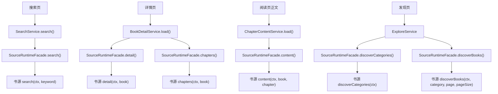
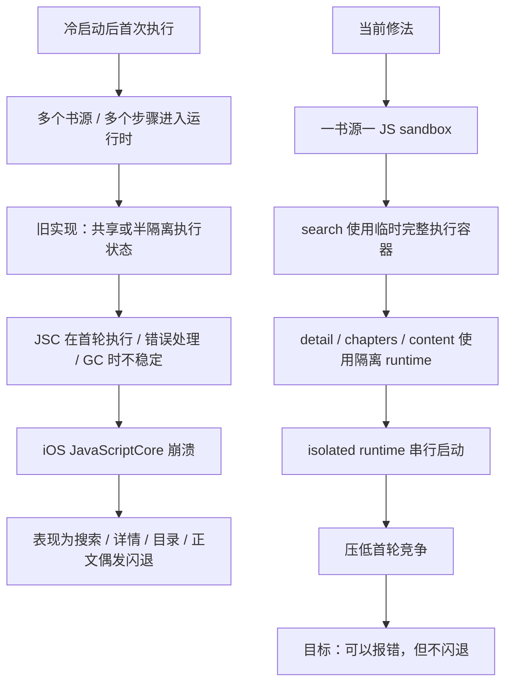

# 搜索首跑与检测首跑不稳定问题梳理

更新时间：2026-04-05

本文用于专门梳理最近暴露出的“脚本源首轮执行偶发闪退 / 断言 / JSC 崩溃”问题。

这不是书源规范文档，也不是作者手册补充；它只回答三件事：

- 现在到底出了什么问题
- 哪些假设已经被验证或被排除
- 后续应该按什么顺序修

附带两张辅助图：

- 脚本源方法调用链
- 本次首轮不稳定问题与当前修法

---

## 1. 问题定义

当前问题不是：

- 某一个书源代码 100% 必错
- 或搜索页 UI 本身有普通逻辑错误

而是：

- 冷启动后，脚本源在某些“首轮执行”场景下会出现偶发不稳定
- 表现可能是 Flutter 断言，也可能是 iOS 上 `JavaScriptCore` 直接崩溃
- 这些问题在“单源先跑一遍”或“某一步先被预热”之后，往往不再出现

目标边界：

- 书源可以失败
- 检测可以报错
- 搜索可以返回单源失败
- **但宿主不应该因为单个源脚本执行失败而闪退**

---

## 2. 已观察到的真实现象

### 2.1 搜索页全局搜索

- 冷启动后直接三源一起搜索，偶发闪退
- 同一批源单独搜索都可能正常
- 单个源先跑一遍，再一起搜索，稳定性明显变好

### 2.2 书源页批量检测

- 单源检测：
  - `仅搜索`
  - `搜索 + 详情`
  - `完整阅读链路`
  都可以正常完成

- 批量检测：
  - `完整阅读链路` 可以正常完成
  - `仅搜索`、`搜索 + 详情` 在某些首轮场景下会出问题

### 2.3 原生断点与 crash report

在 iOS 模拟器上用 Xcode 对 `JavaScriptCore` 下 symbolic breakpoint 后，反复观察到：

- `JSC::createUndefinedVariableError`
- `JSEvaluateScript`
- `JSC::Heap::stopIfNecessarySlow`
- `llint_slow_path_get_from_scope`
- `llint_slow_path_put_by_id`

说明：

- 某些首轮执行期间，JSC 会遇到未定义变量或对象属性写入相关异常
- 异常在错误处理 / GC / 微任务阶段被放大为 native crash

---

## 3. 方法调用链图

下面这张图只回答一个问题：

- 搜索、详情、目录、正文、发现，分别会调书源的哪个方法

---

## 4. 已确认事实

### 4.1 运行时已增加的诊断能力

当前宿主已具备：

- 搜索开始日志
- 检测步骤开始日志
- 运行时未完成调用恢复日志

因此现在可以确认：

- 闪退前最后进入的是哪个 `sourceId`
- 哪个方法：`search / detail / chapters / content`
- 使用的关键词

### 4.2 当前问题和“源码完全一样的两个书源”有关，但不只如此

之前确实存在：

- 相同源码的两个源共用同一个 JS sandbox

这会放大干扰。

当前已经改成：

- **一个书源实例一套 JS sandbox**

但问题仍然存在，说明：

- “共享 sandbox”是放大器，但不是唯一根因

### 4.3 当前问题不是健康系统持久化导致的

健康系统会持久化：

- 失败次数
- 成功次数
- 冷却状态
- 风险等级

但不会持久化：

- JS runtime
- `SourceSession`
- 内存 cache
- 运行时微任务队列

所以这次不稳定不能归因到健康快照残留。

---

## 5. 已排除或需要降级的假设

### 5.1 “某个书源单独运行必错”

这个假设不成立。

原因：

- 单源检测三种级别都可能成功
- 单源搜索也经常成功

所以不能简单把问题定义成：

- 某个源本身根本不可运行

### 5.2 “只是全局 `ctx` 没绑定好”

这个假设只能解释一部分问题。

我们已经补了：

- `ctx/source` 全局绑定兜底

但问题仍然出现。

说明：

- 运行时绑定问题可能存在
- 但当前整体问题已经不止这一个点

---

## 6. 当前最合理的解释

当前最合理的总判断是：

### 6.1 这是“按 source + step 的首轮冷路径问题”

也就是：

- 某个书源第一次执行 `search`
- 某个书源第一次执行 `detail`
- 某个书源第一次执行 `chapters`
- 某个书源第一次执行 `content`

这些步骤各自都有冷启动成本。

如果直接把多个源、多个步骤的首轮执行叠在一起，JSC 更容易进入不稳定状态。

### 6.2 并发并不是唯一问题，但会放大问题

- 批量检测完整链路成功，不代表运行时绝对稳定
- 更可能表示某些步骤在前面已经被顺序预热过
- 搜索页或批量检测的某些组合仍会把“某一步的首次冷执行”直接撞进原生崩溃

### 6.3 当前问题更像“运行时首轮初始化与正式执行混在同一阶段”

而不是：

- 纯书源代码逻辑错误
- 或纯 UI 交互错误

---

## 7. 当前问题与修法图

下面这张图说明：

- 问题不是单一书源语法错误
- 而是首轮 step 执行与运行时稳定性的问题
- 当前修法为什么是“隔离 + 限制首轮竞争”

---

## 8. 当前宿主设计上的缺口

### 8.1 缺少“首轮执行保护”

当前设计没有明确区分：

- 首轮冷执行
- 已预热后的热执行

### 8.2 缺少“按步骤”的冷路径治理

现在只要某个源整体注册好了，就默认认为：

- `search`
- `detail`
- `chapters`
- `content`

都已经稳定可并发执行。

这在当前观察下不成立。

### 8.3 检测链和搜索链仍然过于接近真实运行时

检测目标应该是：

- 稳定判定源是否可用

而不是：

- 在最脆弱的首轮执行路径里，和正式业务流共享所有运行时压力

---

## 9. 设计目标

后续修复要同时满足这几条：

1. 单个书源失败时，只影响该书源
2. 书源检测可以报错，但不把宿主带崩
3. 首轮冷执行和热执行要有不同策略
4. 搜索体验不能永久退化成全串行
5. 日志必须能明确告诉开发者崩前停在 `source + step`

---

## 10. 建议方案

### 10.1 方案 A：按 `source + step` 建立首轮执行保护

原则：

- 每个 `sourceId`
- 每个 `step`
- 第一次执行时采用更保守策略

例如：

- `source A + search`
- `source A + detail`
- `source A + chapters`
- `source A + content`

每个首次执行单独判定。

保护方式建议：

- 首次执行先单飞
- 成功后标记“该 step 已预热”
- 后续恢复正常并发

### 10.2 方案 B：检测链使用隔离运行时

尤其针对：

- 单源检测
- 批量检测

建议：

- 每次检测使用独立 sandbox / 独立运行时上下文
- 检测完成后销毁

目的：

- 减少检测链和正式搜索链之间的运行时耦合
- 降低“检测过程把宿主推入不稳定状态”的概率

### 10.3 方案 C：搜索页只对“冷启动后的第一次全局搜索”做保守调度

不是永久降并发。

而是：

- App 启动后的第一次全局搜索
- 临时降并发
- 或先做一轮 prewarm

等首轮成功后：

- 恢复正常预算

### 10.4 方案 D：导入 / 保存时的静态风险检查

对以下模式做静态提示：

- helper 裸用 `ctx`
- helper 裸用 `source`
- 首轮冷路径里高风险的隐式自由变量使用

这不是替代运行时修复，而是给作者更早反馈。

---

## 11. 当前建议实施顺序

### 阶段 1：继续可观测性

- [x] 搜索开始日志
- [x] 检测步骤开始日志
- [x] 未完成调用恢复日志

### 阶段 2：每源独立 sandbox

- [x] 一书源一 JS sandbox
- [ ] 继续观察是否仍在冷路径崩溃

### 阶段 3：按 `source + step` 做首轮执行保护

- [ ] `search` 首次执行保护
- [ ] `detail` 首次执行保护
- [ ] `chapters` 首次执行保护
- [ ] `content` 首次执行保护

### 阶段 4：检测链隔离运行时

- [ ] 单源检测独立 sandbox
- [ ] 批量检测独立 sandbox

### 阶段 5：搜索页首轮保守调度

- [ ] 冷启动后第一次全局搜索降并发或 prewarm

### 阶段 6：导入静态检查

- [ ] 高风险隐式变量使用告警

---

## 12. 当前最重要的结论

一句话总结：

- **问题不是“某个书源单独必错”**
- **也不只是“隐式 ctx 没绑定”**
- **而是“脚本源某些 step 的首轮冷执行，在当前设计下会被并发或共享运行时压力放大成 JSC 原生崩溃”**

所以后续正确方向是：

- 提升首轮执行隔离和稳定性
- 而不是继续只靠某一条书源手工排查
