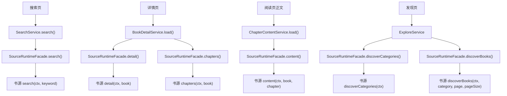
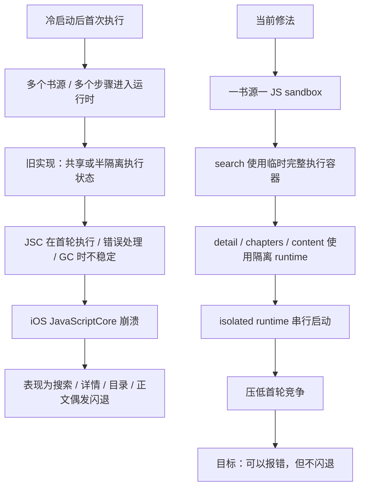

# 搜索首跑与检测首跑不稳定问题梳理

更新时间：2026-04-06

本文用于专门梳理最近暴露出的“脚本源首轮执行偶发闪退 / 断言 / JSC 崩溃”问题。

这不是书源规范文档，也不是作者手册补充；它只回答三件事：

- 现在到底出了什么问题
- 哪些假设已经被验证或被排除
- 后续应该按什么顺序修

附带两张辅助图：

- 脚本源方法调用链
- 本次首轮不稳定问题与当前修法

---

## 0. 当前阶段状态

当前阶段进度概览：

- 阶段 A：已完成
- 阶段 B：已完成基础骨架
- 阶段 C：已完成
- 阶段 D：已完成第一档
- 阶段 E：已完成
- 阶段 F：跳过
- 阶段 G：部分已有基础日志，尚未系统收口
- 阶段 H：等待继续真实链路验证与性能恢复后统一验收

当前最重要的结论：

- 运行时已经从“止血式零散 if/else”推进到“执行策略 + 请求级容器 + 阅读流程容器 + 检测诊断容器”的结构
- 当前主目标仍然是“书源可以失败，但宿主不能闪退”
- 性能恢复还没有结束，后续重点仍然是：
  - 继续收口 startup 串行边界
  - 在不引回闪退的前提下恢复合理并发

---

## 1. 问题定义

当前问题不是：

- 某一个书源代码 100% 必错
- 或搜索页 UI 本身有普通逻辑错误

而是：

- 冷启动后，脚本源在某些“首轮执行”场景下会出现偶发不稳定
- 表现可能是 Flutter 断言，也可能是 iOS 上 `JavaScriptCore` 直接崩溃
- 这些问题在“单源先跑一遍”或“某一步先被预热”之后，往往不再出现

目标边界：

- 书源可以失败
- 检测可以报错
- 搜索可以返回单源失败
- **但宿主不应该因为单个源脚本执行失败而闪退**
- 书源写法不规范时，宿主应优先尝试兼容；兼容失败则应收口成“该源失败 + 原因提示”

---

## 2. 已观察到的真实现象

### 2.1 搜索页全局搜索

- 冷启动后直接三源一起搜索，偶发闪退
- 同一批源单独搜索都可能正常
- 单个源先跑一遍，再一起搜索，稳定性明显变好

### 2.2 书源页批量检测

- 单源检测：
  - `仅搜索`
  - `搜索 + 详情`
  - `完整阅读链路`
  都可以正常完成

- 批量检测：
  - `完整阅读链路` 可以正常完成
  - `仅搜索`、`搜索 + 详情` 在某些首轮场景下会出问题

### 2.3 原生断点与 crash report

在 iOS 模拟器上用 Xcode 对 `JavaScriptCore` 下 symbolic breakpoint 后，反复观察到：

- `JSC::createUndefinedVariableError`
- `JSEvaluateScript`
- `JSC::Heap::stopIfNecessarySlow`
- `llint_slow_path_get_from_scope`
- `llint_slow_path_put_by_id`

说明：

- 某些首轮执行期间，JSC 会遇到未定义变量或对象属性写入相关异常
- 异常在错误处理 / GC / 微任务阶段被放大为 native crash

---

## 3. 方法调用链图

下面这张图只回答一个问题：

- 搜索、详情、目录、正文、发现，分别会调书源的哪个方法

---

## 4. 已确认事实

### 4.1 运行时已增加的诊断能力

当前宿主已具备：

- 搜索开始日志
- 检测步骤开始日志
- 运行时未完成调用恢复日志

因此现在可以确认：

- 闪退前最后进入的是哪个 `sourceId`
- 哪个方法：`search / detail / chapters / content`
- 使用的关键词

### 4.2 当前问题和“源码完全一样的两个书源”有关，但不只如此

之前确实存在：

- 相同源码的两个源共用同一个 JS sandbox

这会放大干扰。

当前已经改成：

- **一个书源实例一套 JS sandbox**

但问题仍然存在，说明：

- “共享 sandbox”是放大器，但不是唯一根因

### 4.3 当前问题不是健康系统持久化导致的

健康系统会持久化：

- 失败次数
- 成功次数
- 冷却状态
- 风险等级

但不会持久化：

- JS runtime
- `SourceSession`
- 内存 cache
- 运行时微任务队列

所以这次不稳定不能归因到健康快照残留。

---

## 5. 已排除或需要降级的假设

### 5.1 “某个书源单独运行必错”

这个假设不成立。

原因：

- 单源检测三种级别都可能成功
- 单源搜索也经常成功

所以不能简单把问题定义成：

- 某个源本身根本不可运行

### 5.2 “只是全局 `ctx` 没绑定好”

这个假设只能解释一部分问题。

我们已经补了：

- `ctx/source` 全局绑定兜底

但问题仍然出现。

说明：

- 运行时绑定问题可能存在
- 但当前整体问题已经不止这一个点

---

## 6. 当前最合理的解释

当前最合理的总判断是：

### 6.1 这是“按 source + step 的首轮冷路径问题”

也就是：

- 某个书源第一次执行 `search`
- 某个书源第一次执行 `detail`
- 某个书源第一次执行 `chapters`
- 某个书源第一次执行 `content`

这些步骤各自都有冷启动成本。

如果直接把多个源、多个步骤的首轮执行叠在一起，JSC 更容易进入不稳定状态。

### 6.2 并发并不是唯一问题，但会放大问题

- 批量检测完整链路成功，不代表运行时绝对稳定
- 更可能表示某些步骤在前面已经被顺序预热过
- 搜索页或批量检测的某些组合仍会把“某一步的首次冷执行”直接撞进原生崩溃

### 6.3 当前问题更像“运行时首轮初始化与正式执行混在同一阶段”

而不是：

- 纯书源代码逻辑错误
- 或纯 UI 交互错误

---

## 7. 当前问题与修法图

下面这张图说明：

- 问题不是单一书源语法错误
- 而是首轮 step 执行与运行时稳定性的问题
- 当前修法为什么是“隔离 + 限制首轮竞争”

---

## 8. 当前宿主设计上的缺口

### 8.1 缺少“首轮执行保护”

当前设计没有明确区分：

- 首轮冷执行
- 已预热后的热执行

### 8.2 缺少“按步骤”的冷路径治理

现在只要某个源整体注册好了，就默认认为：

- `search`
- `detail`
- `chapters`
- `content`

都已经稳定可并发执行。

这在当前观察下不成立。

### 8.3 检测链和搜索链仍然过于接近真实运行时

检测目标应该是：

- 稳定判定源是否可用

而不是：

- 在最脆弱的首轮执行路径里，和正式业务流共享所有运行时压力

### 8.4 异常还没有完全稳定收口成“单源失败”

当前更大的问题不是作者用了哪种写法，而是：

- 宿主还不能稳定地把运行时失败限制在单个书源
- 在某些冷路径和原生错误处理阶段，失败仍会被放大成宿主级闪退

所以当前主线问题应该是：

- 运行时隔离不够
- 首轮执行保护不够
- 原生/JSC 异常收口不够

---

## 9. 设计目标

后续修复要同时满足这几条：

1. 单个书源失败时，只影响该书源
2. 书源检测可以报错，但不把宿主带崩
3. 首轮冷执行和热执行要有不同策略
4. 搜索体验不能永久退化成全串行
5. 日志必须能明确告诉开发者崩前停在 `source + step`
6. 写法不规范的书源，优先表现为“该源失败”，而不是宿主闪退

---

## 10. 建议方案

### 10.1 方案 A：按 `source + step` 建立首轮执行保护

原则：

- 每个 `sourceId`
- 每个 `step`
- 第一次执行时采用更保守策略

例如：

- `source A + search`
- `source A + detail`
- `source A + chapters`
- `source A + content`

每个首次执行单独判定。

保护方式建议：

- 首次执行先单飞
- 成功后标记“该 step 已预热”
- 后续恢复正常并发

### 10.2 方案 B：检测链使用隔离运行时

尤其针对：

- 单源检测
- 批量检测

建议：

- 每次检测使用独立 sandbox / 独立运行时上下文
- 检测完成后销毁

目的：

- 减少检测链和正式搜索链之间的运行时耦合
- 降低“检测过程把宿主推入不稳定状态”的概率

### 10.3 方案 C：搜索页只对“冷启动后的第一次全局搜索”做保守调度

不是永久降并发。

而是：

- App 启动后的第一次全局搜索
- 临时降并发
- 或先做一轮 prewarm

等首轮成功后：

- 恢复正常预算

### 10.4 方案 D：导入 / 保存时的静态风险检查

对以下模式做静态提示：

- helper 裸用 `ctx`
- helper 裸用 `source`
- 首轮冷路径里高风险的隐式自由变量使用

这不是替代运行时修复，而是给作者更早反馈。

但当前阶段它不是主线方案。

主线方案仍然应该是：

- 运行时隔离
- 首轮执行保护
- 原生异常收口
- 失败结果可见

---

## 11. 当前建议实施顺序

### 阶段 1：继续可观测性

- [x] 搜索开始日志
- [x] 检测步骤开始日志
- [x] 未完成调用恢复日志

### 阶段 2：每源独立 sandbox

- [x] 一书源一 JS sandbox
- [ ] 继续观察是否仍在冷路径崩溃

### 阶段 3：按 `source + step` 做首轮执行保护

- [ ] `search` 首次执行保护
- [ ] `detail` 首次执行保护
- [ ] `chapters` 首次执行保护
- [ ] `content` 首次执行保护

### 阶段 4：检测链隔离运行时

- [ ] 单源检测独立 sandbox
- [ ] 批量检测独立 sandbox

### 阶段 5：搜索页首轮保守调度

- [ ] 冷启动后第一次全局搜索降并发或 prewarm

### 阶段 6：导入静态检查

- [ ] 高风险隐式变量使用告警（可选优化项）

---

## 12. 后续优化方向

上面阶段更偏“先止血”，下面这一节回答的是：

- 当前止血版跑通后，后续怎样把性能和结构收回来
- 怎样避免长期停留在“所有高风险步骤都串行、都隔离”的保守模式

### 12.1 从“止血策略”收敛为统一执行策略模块

当前已经做过的改动分散在：

- `SourceExecutor`
- `ScriptSourceRuntimeService`
- `SourceRuntimeFacade`

长期看不适合继续扩散。

建议新增统一模块：

- `SourceRuntimeExecutionPolicyService`

它只负责一件事：

- 根据 `sourceId + step + scene + cold/warm state + risk` 决定当前这次执行策略

建议输出的策略维度至少包含：

- 是否使用共享执行容器
- 是否使用临时隔离执行容器
- 是否要求串行启动
- 成功后是否标记 warm

这样后面：

- 搜索
- 检测
- 详情
- 正文

就不需要各自散落 if/else。

### 12.2 区分“临时”和“隔离”

后续设计里一定要明确：

- 临时：这次执行用完即销毁
- 隔离：这次执行不复用上一轮状态

如果只有临时 runtime，但仍共享：

- session
- cookie
- cache

那只是“临时”，不是真正“隔离”。

长期最优解应该是按场景定义完整执行容器。

### 12.3 搜索最适合做“请求级临时隔离容器”

搜索天然是：

- 独立请求
- 关键词之间不应互相污染

所以长期建议：

- 每次搜索使用完整临时执行容器
  - runtime
  - session
  - cache
  - 必要时 browser state

并且：

- 搜索结果返回后立即销毁

这样最符合“不同关键词搜索互不污染”的业务预期。

### 12.4 详情 / 目录 / 正文更适合做“流程级容器”

详情、目录、正文和搜索不同。

这几步经常要求：

- `detail` 拿到 cookie / 页面状态
- `chapters` 延续这些状态
- `content` 再继续使用

所以长期不建议把：

- `detail`
- `chapters`
- `content`

都拆成完全彼此独立的执行容器。

更合理的方式是：

- 同一条阅读流程内，共享一个临时隔离容器
- 流程结束后再统一销毁

这比“每一步都新建一套环境”更合理，也更有性能优势。

### 12.5 冷时保守，热后放开

当前止血版更偏：

- 先串行
- 先隔离

长期不应该永久停留在这里。

更合理的策略是：

- 冷路径：保守
  - 首次执行
  - 高风险 step
  - fresh runtime 启动
  - bridge 注册
- 热路径：恢复并发
  - 已成功预热
  - 已证明稳定
  - 再允许更高并发

也就是：

- 不做永久全串行
- 不做永久全隔离

### 12.6 只串行“启动”，不串行“全部执行”

当前一个明显经验是：

- 多个 fresh isolated runtime 同时启动，容易把 `flutter_js` bridge 初始化推入不稳定状态

因此长期最优不是：

- 整个请求都串行

而是：

- 只把“启动 / 注册 bridge / 首轮 bootstrap”串行化
- 热起来后执行阶段恢复正常

这能兼顾：

- 稳定性
- 吞吐

### 12.7 建立 warm state 的生命周期

当前 warm state 是为了止血，但后面需要更明确的边界。

建议：

- `key = sourceId + step`
- 仅在进程内生效
- 可设置 TTL

不建议长期持久化：

- JS runtime warm 状态
- JSC 冷热状态

因为这些本来就是进程内状态。

### 12.8 静态检查与运行时保护并行推进

长期不建议只靠运行时兜底。

建议保留并增强：

- 导入时静态检查
- 保存时静态检查
- 对高风险隐式变量使用给出明确警告

这样能把一部分问题提前挡在运行前。

但优先级应低于：

- 运行时隔离
- 异常收口
- 失败展示

### 12.9 推荐的长期形态

可以把最终目标简化成三条：

1. `search`
   - 请求级临时隔离容器
   - 冷启动串行启动
   - 热后恢复并发

2. `detail + chapters + content`
   - 流程级临时隔离容器
   - 同一阅读链共享状态
   - 流程结束后销毁

3. `check`
   - 独立诊断容器
   - 默认比正式业务流更保守

这样最符合业务，也最容易解释。

---

## 13. 当前最重要的结论

一句话总结：

- **问题不是“某个书源单独必错”**
- **也不只是“隐式 ctx 没绑定”**
- **而是“脚本源某些 step 的首轮冷执行，在当前设计下会被并发或共享运行时压力放大成 JSC 原生崩溃”**

所以后续正确方向是：

- 提升首轮执行隔离和稳定性
- 提升原生/JSC 异常的宿主收口能力
- 把问题尽量收敛成“该源失败 + 原因提示”
- 而不是继续只靠某一条书源手工排查

---

## 14. 下一阶段执行清单

这一节把后续优化收成可执行、可打勾的阶段任务。

### 阶段 A：统一执行策略模块

- [x] 新增 `SourceRuntimeExecutionPolicyService`
- [x] 基础收口 `search / detail / chapters / content / discover` 的执行决策
- [ ] 策略输出至少包含：
  - [ ] 是否使用共享容器
  - [ ] 是否使用临时隔离容器
  - [ ] 是否要求串行启动
  - [ ] 成功后是否标记 warm
- [ ] 移除当前散落在 `Facade / RuntimeService / Executor` 的临时 if/else

当前进度说明：

- 已把 facade 层对 `search / detail / chapters / content / discover` 的执行模式选择统一收口到策略服务
- 当前仍处于“策略统一、容器实现暂保持现状”的阶段
- `source_check` 仍未并入统一策略服务，后续在检测链独立容器阶段一起收口

### 阶段 B：搜索请求级完整隔离容器

- [x] 搜索执行容器不再复用上一次搜索的 session
- [x] 搜索执行容器不再复用上一次搜索的 cookie 状态
- [x] 搜索执行容器不再复用上一次搜索的 cache
- [x] 搜索执行容器创建后用完即销毁
- [ ] 验证“先搜 A，再搜 B”不会相互污染

当前进度说明：

- 已新增请求级执行容器骨架，搜索/发现链路不再在运行时服务里临时拼装 session/cache/executor
- 搜索与发现当前都复用同一类“请求级隔离容器”实现
- 后续还需要继续把“搜索后切换关键词不污染”的实机场景验证补成更系统的回归测试

### 阶段 C：阅读流程级容器

- [x] 为 `detail -> chapters -> content` 建立流程级隔离容器
- [x] 同一条阅读流程内共享 session / cookie / cache
- [x] 不跨阅读流程复用容器
- [x] 流程结束后销毁容器
- [x] 验证“从搜索进入详情再进正文”不会闪退

当前进度说明：

- 已新增阅读流程容器存储，并让 `detail / chapters / content` 对同一条书籍流程复用同一套隔离 session/cache/executor
- 已有回归测试覆盖：
  - `detail()` 写入 session 状态
  - `chapters()` / `content()` 继续读取到相同状态
  - 同一条流程只编译一次脚本
- 已在详情页与阅读页退出时主动清理当前阅读流程容器
- 已补齐不同书籍不复用 flow 的回归测试
- 已在详情页换源、阅读页换源时即时释放旧 flow

### 阶段 D：冷启动与热启动策略

- [x] 将 warm 状态从简单 bool 升级为更清晰的状态
  - [x] `cold`
  - [x] `warming`
  - [x] `warm`
  - [x] `unstable`
- [x] 冷路径使用保守策略
- [x] 热路径开始恢复更宽松执行
- [ ] 只串行“启动/bootstrap/bridge 注册”，不串行整个业务执行

当前进度说明：

- 已新增 `SourceRuntimeWarmStateService` 状态机，按 `source + step` 维护 `cold / warming / warm / unstable`
- 已把执行策略决策接入 warm state：
  - 冷态首轮仍保守执行
  - 成功后标记 warm
  - 失败后标记 unstable
- 已在搜索/发现/阅读链把 `serializeStartup` 接入运行时调用
- 当前 warm 后的行为已经不再强制继续走冷态串行 startup
- 下一步仍需继续收口“只串行 startup，不串行整个执行”的底层实现边界

### 阶段 E：检测链独立策略

- [x] 单源检测使用独立诊断容器
- [x] 批量检测使用独立诊断容器
- [x] 检测链默认比正式业务链更保守
- [x] 检测链结果继续回写健康系统
- [x] 验证批量检测各级别不闪退

当前进度说明：

- 已新增独立诊断执行容器，单次 `checkSource()` 会优先创建自己的隔离 session/cache/executor/source
- 检测链现在不再直接复用正式搜索链或阅读流程链的运行时容器
- 同一次检测内的 `search -> detail -> chapters -> content` 会共享同一套诊断容器，检测结束后立即释放
- 已补回归测试验证：
  - 检测优先走诊断容器
  - 正式 facade 的 `search/detail/chapters/content` 不会被误调用
  - 诊断容器会在检查结束后销毁
  - 批量检测会为每个源分别创建并释放自己的诊断容器
  - `searchAndDetail` / `fullReadPath` 继续回写健康系统成功状态

### 阶段 F：静态检查与作者反馈

- [ ] 本阶段已跳过，不作为当前主线推进内容

跳过说明：

- 当前主目标是“书源失败要能收口成错误提示，宿主不能闪退”
- 静态检查与作者反馈属于可选优化，不影响当前运行时主线稳定性
- 文档仍保持“helper 显式接收 ctx”为推荐写法，但不把静态检查作为当前阶段硬要求

### 阶段 G：可观测性补强

- [x] 保留 `source started`
- [x] 保留 `step started`
- [x] 保留 `unfinished invocation recovered`
- [x] 新增 `cold/warm/isolated/shared` 执行模式日志
- [x] 新增容器创建/销毁日志
- [ ] 确保问题发生时可以准确定位到 `source + step + mode`

当前进度说明：

- 搜索链已有 `Search source started`
- 检测链已有 `Source check step started`
- 运行时已有 `Recovered unfinished source runtime invocation`
- 已新增 `Source runtime execution plan`，统一输出：
  - `step`
  - `scene`
  - `containerKind`
  - `warmState`
  - `serializeStartup`
- 已新增请求容器 / 阅读流程容器 / 诊断容器的创建与销毁日志
- 当前还剩最后一项：继续把这些日志与真实故障链路对齐，确保遇到问题时能一眼锁定 `source + step + mode`

### 阶段 H：验收标准

- [ ] 冷启动首次全局搜索不闪退
- [ ] 搜索后进入详情页不闪退
- [ ] 进入目录页不闪退
- [ ] 进入正文页不闪退
- [ ] 批量检测 `仅搜索 / 搜索+详情 / 完整阅读链路` 都不闪退
- [ ] 不同关键词的连续搜索不会互相污染
- [ ] 失败书源会稳定收口成错误提示，而不是宿主闪退
- [ ] 稳定后再逐步恢复合理并发

当前验收拆分：

#### 自动化已覆盖

- [x] 搜索链已走请求级隔离容器，连续两次搜索都会命中独立请求执行路径
- [x] 阅读链已具备流程级容器，`detail -> chapters -> content` 可以共享同一套 session/cache/executor
- [x] 阅读流程在切书、换源、退出页面后会释放旧 flow，不跨流程复用
- [x] 检测链已走独立诊断容器，单源和批量检测都不复用正式业务运行时
- [x] `searchAndDetail` / `fullReadPath` 的检测结果仍会回写健康系统
- [x] 执行计划、warm state、容器创建/销毁日志已经可见

#### 仍需真实链路手动验收

- [ ] 冷启动后首次全局搜索真实跑一轮，确认不闪退
- [ ] 搜索结果进入详情页，再进入目录页和正文页，确认整条链真实不闪退
- [ ] 批量检测 `仅搜索 / 搜索+详情 / 完整阅读链路` 在真实界面里都不闪退
- [ ] 连续输入不同关键词搜索，确认真实链路无相互污染
- [ ] 让一个坏源真实失败一次，确认最终表现为错误提示而不是宿主闪退
- [ ] 在完成更多性能恢复前，不把“逐步恢复合理并发”判定为完成
